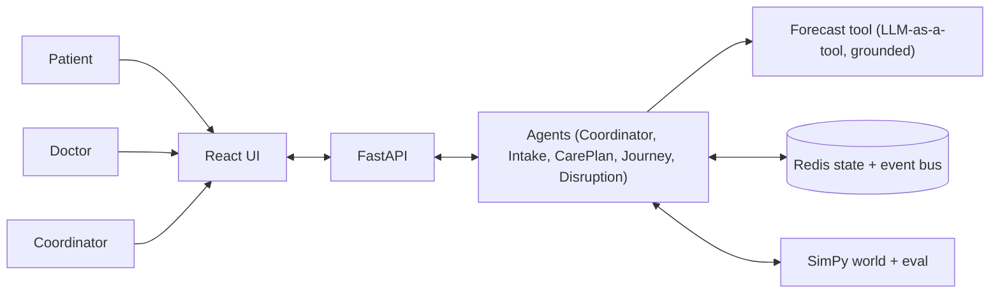

# System overview - VAIC - AI Care Pathway Coordinator

High-level architecture. The requirements contract is `docs/specs/` (the source of truth); this page
orients a reader before they open it. Detailed decisions live in `docs/architecture/decisions/` (ADRs).

## What it is

An AI-native care-pathway coordination layer: a team of cooperating agents that route patients, plan
and sequence their service tasks, and re-coordinate around disruptions - to cut wait times and ease
congestion. Delivery is a hackathon demo on a SimPy simulator with synthetic data (no real PHI).

## The three-phase clinical boundary (the core invariant)

1. Intake Agent routes to a diagnostic consult (triage, not diagnosis).
2. The doctor diagnoses and signs service orders - the clinical source of truth.
3. AI turns signed orders into a sequenced, slotted task list and coordinates the logistics.

AI never diagnoses and never generates a service order (CO-02). See `docs/specs/04-business-flows.md`.

## Components

- **Agents** (`src/vaic/agents/`): Coordinator + Disruption (core), Intake, Care Plan, Journey.
  LLM-backed, acting only through a closed tool set with a deterministic constraint checker.
- **Forecast tool** (`src/vaic/forecast/`): an LLM-with-reasoning exposed as a tool, ETA/load/no-show,
  under the retrieve-reason-validate grounding contract (spec FR-07, OI-20).
- **State and events** (`src/vaic/state/`): Redis for real-time state and the event bus.
- **Simulator** (`src/vaic/simulator/`): the SimPy world and the eval harness (A/B vs FIFO).
- **Frontend** (`frontend/src/`): React chat + timeline (patient) and dashboard (coordinator).

## Key decisions and open issues

- Agent framework (LangGraph vs FastAPI tool-loop) - not yet chosen (spec OI-18, TASK-001).
- Governance (model sovereignty, residency, licences, IP) - undecided (KI-01..04, TASK-002).
- Durable store beyond Redis - not chosen (spec OI-15).

See `docs/specs/11-assumptions-constraints.md` for the full open-issue register.
