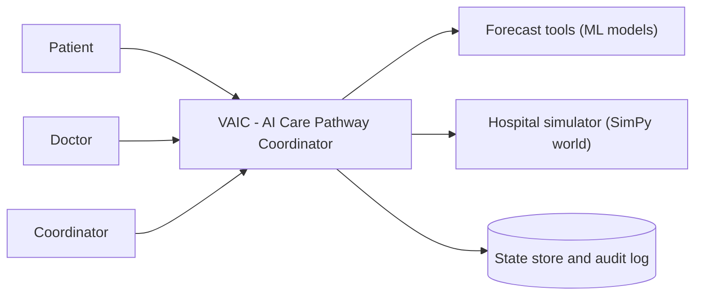

# Overview

## Context

VI: Trong bệnh viện, bệnh nhân thường dồn cục vào cùng khung giờ trong khi các slot khác bỏ trống, bị chỉ sai khu và phải đi lại nhiều lần, và chờ mà không biết còn bao lâu - vì dữ liệu đặt lịch, tiếp nhận, phòng khám, xét nghiệm và chẩn đoán hình ảnh không được nối thành một bức tranh điều phối thống nhất. VAIC là một lớp điều phối AI-native: thay vì "phần mềm quản lý hàng đợi có gắn AI", hệ thống là một đội ngũ agent điều phối làm việc liên tục, còn code truyền thống là công cụ (tools) và hàng rào an toàn (guardrails) của họ.

EN: In a hospital, patients bunch up at the same times while other slots sit empty, get sent to the wrong area and backtrack, and wait without knowing how long - because appointment, check-in, clinic, lab, and imaging data are not joined into a single coordinated view. VAIC is an AI-native coordination layer: rather than "queue software with AI bolted on", it is a team of coordination agents working continuously, with conventional code as their tools and guardrails.

Bối cảnh build này là **bản demo hackathon chạy trên simulator (SimPy)**, không tích hợp hệ thống bệnh viện thật và không dùng dữ liệu bệnh nhân thật. / This build is a **hackathon demo running on a SimPy simulator**, with no real hospital-system integration and no real patient data. See [AS-02](11-assumptions-constraints.md) and [CO-01](11-assumptions-constraints.md).

## App concept and platform

VI: VAIC là **một web app responsive, phân quyền theo vai** (patient/doctor/technician/coordinator/admin) - một lần đăng nhập, định tuyến theo vai ([FR-18](05-functional-requirements.md#fr-18)). Giao diện bệnh nhân ưu tiên mobile (chat + timeline + mã QR); giao diện nhân viên/điều phối ưu tiên desktop. Mức độ hoàn thiện cho bản demo là **"believable-but-lean"**: đủ khung để trông như sản phẩm thật (xác thực đơn giản, dữ liệu seed, trang chủ theo vai, trung tâm thông báo, cài đặt + chuyển ngôn ngữ VI/EN, tìm bệnh nhân cho nhân viên) nhưng các chức năng hỗ trợ được giữ tối giản. Hướng thiết kế nhẹ (design system) được định nghĩa trong [10](10-ui-ux-wireframes.md).

EN: VAIC is **one responsive, role-gated web app** (patient/doctor/technician/coordinator/admin) - a single login with role-based routing ([FR-18](05-functional-requirements.md#fr-18)). Patient views are mobile-first (chat + timeline + QR); staff/coordinator views are desktop-first. Demo completeness is **"believable-but-lean"**: enough scaffolding to read as a real product (simple auth, seeded data, a per-role home, a notifications center, settings + VI/EN toggle, staff patient search) while supporting features stay minimal. A lightweight design direction is defined in [10](10-ui-ux-wireframes.md).

## Problem statement

VI: Dữ liệu vận hành của các khu (đặt lịch, tiếp nhận, phòng khám, lab, imaging, trạng thái thiết bị) rời rạc, nên không ai có cái nhìn thời gian thực về tải toàn viện. Hệ quả: ùn tắc theo giờ, bệnh nhân đi sai khu và lặp lại hàng đợi, thời gian chờ không dự báo được, công suất phòng/thiết bị thấp.

EN: Operational data across areas (appointments, check-in, clinics, labs, imaging, equipment status) is fragmented, so no one has a real-time view of hospital-wide load. The result: hourly congestion, patients sent to the wrong area and re-queuing, unpredictable wait times, and low room/equipment utilisation.

| Aspect | Today |
|--------|-------|
| Who is affected | Bệnh nhân, bác sĩ, kỹ thuật viên, điều phối viên / Patients, doctors, technicians, coordinators |
| Current process | Đặt lịch và xếp hàng thủ công theo FIFO từng khu; mỗi khu tự quản hàng đợi, không điều phối chéo / Manual FIFO queueing per area; each area manages its own queue, no cross-area coordination |
| Cost of the status quo | Không định lượng trong nguồn - see [OI-08](11-assumptions-constraints.md#oi-08) / Not quantified in the source - see [OI-08](11-assumptions-constraints.md#oi-08) |
| Trigger for change | Cuộc thi hackathon AI-native; mục tiêu chứng minh điều phối bằng agent vượt rule cứng / Hackathon; goal is to show agent-based coordination beating hard-coded rules |

## Goals

| ID | Goal | Rationale |
|----|------|-----------|
| G-01 | Giảm thời gian chờ trung bình so với baseline FIFO trên cùng tập mô phỏng / Reduce average wait time versus a FIFO baseline on the same simulated cohort | Tiêu chí chấm điểm chính / The primary judging criterion |
| G-02 | Giảm ùn tắc (đỉnh tải) giữa các khu / Ease congestion (peak load) across areas | Dàn tải làm tăng thông lượng / Load levelling raises throughput |
| G-03 | Tăng công suất sử dụng phòng và thiết bị / Raise room and equipment utilisation | Slot trống bên cạnh nơi quá tải là lãng phí / Empty slots beside overloaded ones are waste |
| G-04 | Cho bệnh nhân chủ động theo dõi lộ trình / Let patients actively track their own care pathway | Minh bạch chờ đợi giảm lo lắng và cuộc gọi hỏi / Transparency reduces anxiety and inbound questions |
| G-05 | Chứng minh suy luận agent xử lý sự cố tổ hợp rule cứng không phủ nổi / Demonstrate agent reasoning handling combinatorial disruptions hard rules cannot cover | Luận điểm định vị AI-native trước giám khảo / The AI-native positioning argument to judges |

## Non-goals

- VAIC **không chẩn đoán và không chỉ định dịch vụ**; quyết định lâm sàng thuộc về bác sĩ. / VAIC does **not diagnose and does not order clinical services**; clinical decisions belong to the doctor. See [FR-01](05-functional-requirements.md#fr-01) and the guardrails in [06](06-access-control.md).
- Không tích hợp HIS/EMR/LIS/PACS thật trong bản demo. / No real HIS/EMR/LIS/PACS integration in the demo.
- App KHÔNG xử lý thanh toán; "thanh toán" chỉ là một cờ cho phép tiến hành, việc trả tiền diễn ra ngoài app. / The app processes no payment; "payment" is only a proceed-gate flag, actual paying happens outside the app. See [FR-05](05-functional-requirements.md#fr-05).
- Không phải hồ sơ bệnh án điện tử; VAIC chỉ điều phối logistics. / Not an electronic medical record; VAIC only coordinates logistics.
- Không có tự đăng ký bệnh nhân trong bản này; bệnh nhân được tạo qua seed/tiếp nhận, không có onboarding tự phục vụ. / No patient self-registration this release; patients are created via seed/intake, not a self-service onboarding. See [AS-06](11-assumptions-constraints.md).

## Scope

### In scope

- Tiếp nhận và định tuyến hội thoại / Conversational intake and routing: [FR-01](05-functional-requirements.md#fr-01)
- Đề xuất khung giờ ít đông / Least-crowded slot recommendation: [FR-02](05-functional-requirements.md#fr-02)
- Ghi nhận chẩn đoán và chỉ định của bác sĩ / Doctor diagnosis and service-order capture: [FR-03](05-functional-requirements.md#fr-03)
- Sinh và sắp thứ tự danh sách task / Task-list generation and sequencing: [FR-04](05-functional-requirements.md#fr-04)
- Cổng thanh toán khóa task / Payment gate locking tasks: [FR-05](05-functional-requirements.md#fr-05)
- Hộ tống bệnh nhân và tái sắp xếp / Per-patient escort and resequencing: [FR-06](05-functional-requirements.md#fr-06)
- Dự báo ETA/tải/no-show / ETA, load, and no-show forecasting: [FR-07](05-functional-requirements.md#fr-07)
- Xếp slot theo capacity bác sĩ / Slot allocation on doctor capacity: [FR-08](05-functional-requirements.md#fr-08)
- Xử lý sự cố phân tầng tự chủ / Disruption handling with tiered autonomy: [FR-09](05-functional-requirements.md#fr-09)
- Vòng lặp điều phối trung tâm / Central coordination loop: [FR-10](05-functional-requirements.md#fr-10)
- Thông báo bệnh nhân trên timeline / Patient timeline notifications: [FR-11](05-functional-requirements.md#fr-11)
- Dashboard điều phối / Coordinator dashboard: [FR-12](05-functional-requirements.md#fr-12)
- Nhật ký suy luận agent / Agent reasoning audit log: [FR-13](05-functional-requirements.md#fr-13)
- Quét mã bệnh nhân cập nhật trạng thái (hệ sinh thái bệnh nhân - bác sĩ - viện) / Patient-code scan status update (patient-doctor-hospital ecosystem): [FR-17](05-functional-requirements.md#fr-17)
- Chức năng hỗ trợ (rounded app) / Supporting functions: xác thực & phân quyền [FR-18](05-functional-requirements.md#fr-18), đổi/hủy lịch [FR-19](05-functional-requirements.md#fr-19), trung tâm thông báo [FR-20](05-functional-requirements.md#fr-20), cài đặt + ngôn ngữ VI/EN [FR-21](05-functional-requirements.md#fr-21), tìm bệnh nhân [FR-22](05-functional-requirements.md#fr-22)
- Hướng thiết kế nhẹ (design system) / lightweight design direction: [10](10-ui-ux-wireframes.md) "Visual design direction"

### Out of scope

- Chat của bác sĩ với worklist / Doctor worklist chat: [FR-14](05-functional-requirements.md#fr-14) - Could, cắt trước nếu thiếu thời gian / first to cut.
- Kênh SMS / SMS channel: [FR-15](05-functional-requirements.md#fr-15) - Could; demo dùng thông báo in-app / demo uses in-app notifications.
- Learning loop (retrain forecast, agent memory, EMA service-time) / Learning loop: [FR-16](05-functional-requirements.md#fr-16) - Won't this release; bước demo "MAE giảm theo tuần" đã bỏ ([OI-01](11-assumptions-constraints.md#oi-01) resolved) / the MAE-improvement demo step is dropped.

## Success metrics

| Metric | Baseline (today) | Target | How it is measured |
|--------|------------------|--------|--------------------|
| Thời gian chờ trung bình / Avg wait time | FIFO baseline run - unknown cho tới khi chạy, see [OI-08](11-assumptions-constraints.md#oi-08) | Giảm so với baseline / Lower than baseline (số cụ thể chưa chốt - [OI-05](11-assumptions-constraints.md#oi-05)) | So sánh A/B trên cùng tập mô phỏng / A/B on the same simulated cohort |
| Đỉnh tải theo khu / Peak load per area | FIFO baseline run | Đỉnh thấp hơn, phân bố phẳng hơn / Lower peak, flatter distribution | Heatmap + thống kê hàng đợi / Heatmap + queue stats in the simulator |
| Công suất phòng/thiết bị / Room-equipment utilisation | FIFO baseline run | Cao hơn baseline / Higher than baseline | % thời gian bận / % busy time in the simulator |
| Sai số dự báo ETA (MAE) / ETA forecast error (MAE) | Chưa đo / Not measured | Đủ thấp để bệnh nhân tin ETA / Low enough to be actionable - target chưa chốt [OI-05](11-assumptions-constraints.md#oi-05) | Dự báo vs thực tế mô phỏng / Predicted vs simulated actual |

## Contest brief (guiding source) {#contest-brief}

VI: Bản tóm tắt cuộc thi dưới đây (do Team lead cung cấp) là **nguồn yêu cầu dẫn dắt** mà sản phẩm này tiến hoá xung quanh - không phải một nguồn tham khảo song song với `docs/proposal.md`, mà là điểm neo cấp cao hơn mà cả proposal lẫn 22 FR đều phải truy vết về. Bản tóm tắt được trích **nguyên văn** (giữ tiếng Anh gốc, không dịch, để không bên nào có thể tranh cãi diễn giải); phần khung bilingual chỉ áp dụng cho lời dẫn và các bảng truy vết bên dưới.

EN: The contest summary below (supplied by the Team lead) is the **guiding requirement source** this product evolves around - not a reference parallel to `docs/proposal.md`, but the higher-level anchor that both the proposal and the 22 FRs must trace back to. The brief is quoted **verbatim** (kept in its original English, not translated, so no side can dispute the wording); the bilingual framing applies only to the lead-in and the traceability tables below.

> **Problem Statement** - Hospitals lack a unified, real-time view of how patients move through the system. Appointment, registration, clinic, lab, and imaging data sit in silos. Result: patients bunch up in the same slots while others go unused; patients get routed to the wrong area and backtrack; patients wait with no visibility into how long it will take. Goal: build a smart coordination system connecting appointments, check-in, clinics, labs, imaging, and real-time department status into one system.
>
> **Core Features**
> 1. Appointment Coordination - distribute patients across doctors, specialties, and time slots; prevent overcrowding at popular times while other slots stay empty; balance load dynamically based on real demand, not fixed scheduling.
> 2. Patient Routing - route based on symptoms, priority level, patient category, and required services; direct patients to the correct area from the first step; eliminate repeated trips and wrong-queue errors.
> 3. Wait-Time Estimation - analyze number of patients waiting, average consultation time, and clinic/equipment status; forecast expected service time per patient; display via app, digital screen, or SMS.
> 4. Service-Sequencing Recommendations - auto-order tests/procedures (blood work, ultrasound, X-ray, CT, MRI, etc.); base sequencing on wait times, fasting requirements, result turnaround time, and equipment availability; example: draw blood -> X-ray while blood processes -> ultrasound -> return to doctor once all results ready; minimize idle waiting and backtracking.
> 5. Real-Time Adjustment - re-coordinate the plan when a clinic is overloaded, equipment fails, a doctor's schedule shifts, or an emergency arrives; keep all downstream steps (routing, sequencing, wait estimates) updated automatically.
>
> **Success Metrics** - reduced average patient wait time; reduced congestion across departments; increased clinic and equipment utilization; patients able to actively track their own care pathway in real time.

### Core feature to FR traceability

VI: Bảng dưới nối mỗi tính năng cốt lõi của brief với các FR hiện có đáp ứng nó. Không FR nào được tạo mới cho việc này - nếu một tính năng của brief không có FR khớp đủ, điều đó được ghi thành open issue ở [11](11-assumptions-constraints.md), không phải một FR ngầm định thêm vào.

EN: The table below links each core feature of the brief to the existing FRs that satisfy it. No FR was created for this exercise - where a brief feature is not fully covered by an existing FR, that gap is recorded as an open issue in [11](11-assumptions-constraints.md), not quietly folded in as added scope.

| Brief core feature | Satisfied by | How |
|---|---|---|
| 1. Appointment Coordination | [FR-02](05-functional-requirements.md#fr-02), [FR-08](05-functional-requirements.md#fr-08) | FR-02 proposes the least-crowded slot ranked by forecast load, avoiding same-time bunching; FR-08's `allocate_slot()` assigns each task a slot within doctor/room capacity, keeping load dynamic rather than fixed-schedule. |
| 2. Patient Routing | [FR-01](05-functional-requirements.md#fr-01), [FR-06](05-functional-requirements.md#fr-06) | FR-01 routes on symptoms via a structured triage record `{specialty, priority_level, constraints}`, directing the patient to the correct area from the first step; FR-06's Journey Agent escorts and resequences per patient to prevent backtracking and repeated queues once the pathway is under way. See the flagged gap on "patient category" below. |
| 3. Wait-Time Estimation | [FR-07](05-functional-requirements.md#fr-07), [FR-11](05-functional-requirements.md#fr-11), [FR-15](05-functional-requirements.md#fr-15) | FR-07 forecasts per-room ETA, hourly load, and no-show from queue length, historical service time, and equipment (`Resource.is_available`); FR-11 displays it to the patient in-app (chat + timeline), in scope for this demo; FR-15 extends display to a waiting screen and SMS but is Could-priority and out of scope this release (see [Out of scope](#out-of-scope) above). |
| 4. Service-Sequencing Recommendations | [FR-04](05-functional-requirements.md#fr-04) | FR-04's Care Plan Agent auto-orders tests/procedures from the doctor's `ServiceOrder`s, sequencing on fasting requirements, turnaround, and dependency; AC-04.1 encodes the brief's own example (blood draw first, X-ray while blood processes, then ultrasound). |
| 5. Real-Time Adjustment | [FR-09](05-functional-requirements.md#fr-09), [FR-10](05-functional-requirements.md#fr-10) | FR-09's Disruption Agent re-plans on overload, equipment failure, doctor-schedule shift, or emergency, auto-executing under threshold N and routing larger blast radius to coordinator approval; FR-10's Coordinator Agent runs the perceive-reason-act loop that keeps downstream routing, sequencing, and wait estimates consistent after a re-plan. |

### Success metric to goal traceability

VI: Bốn success metric của brief đối chiếu với các Goal đã có (G-01..G-04) và bảng Success metrics ở trên; không thêm Goal mới.

EN: The brief's four success metrics map onto the existing Goals (G-01..G-04) and the Success metrics table above; no new Goal was added.

| Brief success metric | Goal | Success metrics table row |
|---|---|---|
| Reduced average patient wait time | [G-01](#goals) | "Avg wait time" |
| Reduced congestion across departments | [G-02](#goals) | "Peak load per area" |
| Increased clinic and equipment utilization | [G-03](#goals) | "Room-equipment utilisation" |
| Patients able to actively track their own care pathway in real time | [G-04](#goals) | No dedicated quantified row - G-04 is tracked qualitatively via [FR-06](05-functional-requirements.md#fr-06), [FR-11](05-functional-requirements.md#fr-11), [FR-17](05-functional-requirements.md#fr-17); see [OI-05](11-assumptions-constraints.md#oi-05) on unset numeric targets generally. |

VI: Một khoảng trống thực đã được rà soát và ghi lại thay vì âm thầm bổ sung phạm vi: tính năng 2 của brief nêu "patient category" (VD trẻ em/người lớn tuổi/nhóm bảo hiểm) như một tiêu chí định tuyến, nhưng schema triage của [FR-01](05-functional-requirements.md#fr-01) hiện chỉ có `{specialty, priority_level, constraints}` - không có trường patient-category tường minh. Xem [OI-23](11-assumptions-constraints.md#oi-23).

EN: One genuine gap was reviewed and recorded rather than silently folded into scope: the brief's Feature 2 names "patient category" (e.g. child/elderly/insurance class) as a routing criterion, but [FR-01](05-functional-requirements.md#fr-01)'s triage schema currently holds only `{specialty, priority_level, constraints}` - no explicit patient-category field. See [OI-23](11-assumptions-constraints.md#oi-23).

## Judging criteria

VI: Bài thi được chấm trên 6 tiêu chí, tổng 100 điểm. Bảng dưới nối mỗi tiêu chí với nơi bộ đặc tả đáp ứng - dùng khi chuẩn bị phần trình bày và phòng thủ (Presentation & Defensibility).

EN: The entry is scored on six criteria totalling 100 points. The table maps each criterion to where this spec set addresses it - use it when preparing the pitch and defence.

| Criterion | Points | Addressed in |
|-----------|--------|--------------|
| Technical Implementation | 20 | [05](05-functional-requirements.md) FRs, [08](08-data-model.md) data model, [09](09-integration-interface.md) integrations, [12](12-technical-feasibility.md) approach and PoCs |
| AI-Native Architecture & Innovation | 20 | Multi-agent orchestration [FR-09](05-functional-requirements.md#fr-09), [FR-10](05-functional-requirements.md#fr-10); [04](04-business-flows.md) flows; the ecosystem scan [FR-17](05-functional-requirements.md#fr-17) |
| Business Viability & Pilot Pathway | 20 | [01](01-overview.md) goals and metrics; [11](11-assumptions-constraints.md) demo-to-production open issues; [12](12-technical-feasibility.md) pilot risks and effort |
| AI-Native UX & Design Thinking | 15 | [10](10-ui-ux-wireframes.md) chat + timeline + dashboard, the "Visual design direction" design system, model-assisted elements and AI labelling ([NFR-USE-05](07-non-functional-requirements.md#nfr-usability)); one responsive role-gated app ([FR-18](05-functional-requirements.md#fr-18)) |
| AI Safety, Grounding & Trust | 15 | Guardrails [CO-02..CO-05](11-assumptions-constraints.md); [07](07-non-functional-requirements.md#nfr-security) security; grounding [NFR-SEC-20](07-non-functional-requirements.md#nfr-security); audit [FR-13](05-functional-requirements.md#fr-13) |
| Presentation & Defensibility | 10 | This map; the honest open issues in [11](11-assumptions-constraints.md) and Partial/No rows in [12](12-technical-feasibility.md) |

<!-- Note the tension worth defending out loud: Forecast is now an LLM-backed tool (OI-20), chosen for
     speed over ML training - which pressures the 15-point AI Safety score. Defence: grounding +
     range-validation (NFR-SEC-20) keeps every number traceable to observed data. -->

## System context

## AI in this system

VI: LLM suy luận và điều phối; Forecast là một **LLM-with-reasoning expose thành tool** sinh số; code kiểm tra ràng buộc. Nguyên tắc: mọi con số dự báo phải neo được vào dữ liệu quan sát (grounding) và validate dải, không bịa tự do; và LLM không quyết định lâm sàng.

EN: The LLM reasons and coordinates; the Forecast tool is an **LLM-with-reasoning exposed as a tool** that produces numbers; deterministic code enforces constraints. Principle: every forecast number must be grounded in observed data and range-validated, never fabricated freely, and the LLM never makes a clinical decision. See [OI-20](11-assumptions-constraints.md#oi-20).

| Question | Answer |
|----------|--------|
| What the model produces | Định tuyến triage, thứ tự task, phương án re-plan, tin nhắn giải thích / Triage routing, task ordering, re-plan options, explanation messages |
| Who or what consumes it | Bệnh nhân (Journey Agent), điều phối viên (dashboard), các agent khác / Patients, coordinators, other agents |
| Is a human in the loop | Có - phân tầng: ảnh hưởng lớn cần điều phối viên duyệt; phân loại chuyên khoa luôn hiển thị cho nhân viên xác nhận / Yes - tiered: large-impact actions need coordinator approval; specialty classification is always shown to staff to confirm. See [FR-09](05-functional-requirements.md#fr-09) |
| What happens when it is wrong | Constraint checker chặn action sai; điều phối viên override; audit log giải trình / Constraint checker blocks invalid actions; coordinator overrides; audit log explains. See [FR-13](05-functional-requirements.md#fr-13) |
| Untrusted content reaching the model | Có - chat triệu chứng bệnh nhân bằng ngôn ngữ tự nhiên / Yes - patient symptom chat. Treated as data, never instructions - see [NFR-SEC-11](07-non-functional-requirements.md#nfr-security) |

## References

- Contest brief - the guiding requirement source, quoted verbatim in [Contest brief (guiding source)](#contest-brief) above; supplied by the Team lead as the original hackathon problem statement, core features, and success metrics.
- `docs/proposal.md` - AI-native proposal (bilingual): problem statement and multi-agent architecture, sections 1-8.
- Elicitation session: 4 decisions confirmed by Team lead (delivery = hackathon/demo on simulator; language = bilingual; learning loop = out of scope; security owner = Team lead, no real PHI).
