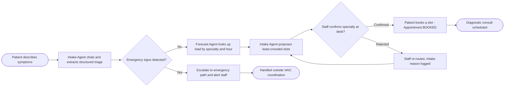
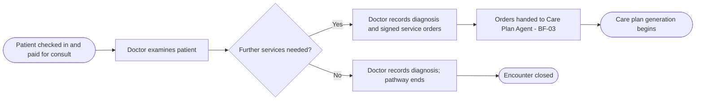
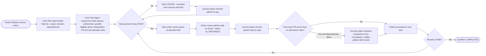
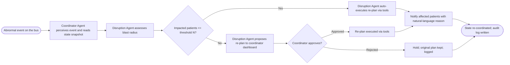
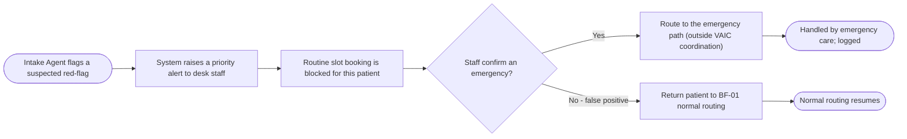
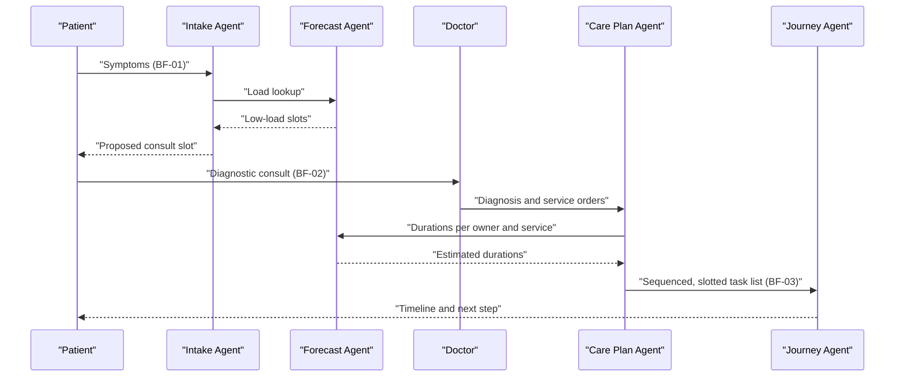

# Business flows

<!-- The clinical pathway is deliberately three-phase: AI routes before diagnosis, the doctor
     diagnoses and orders, then AI coordinates logistics. The phase boundary is the core guardrail -
     do not let a flow cross it (AI never generates a service order). -->

## Flow index

| ID | Flow | Trigger | Primary actor | Serves |
|----|------|---------|---------------|--------|
| BF-01 | Tiếp nhận và định tuyến khám chẩn đoán / Intake and routing to a diagnostic consult | Bệnh nhân mở chat triệu chứng / Patient opens symptom chat | role_patient | [FR-01](05-functional-requirements.md#fr-01), [FR-02](05-functional-requirements.md#fr-02) |
| BF-02 | Khám và chẩn đoán / Consult and diagnosis | Bệnh nhân đến buổi khám chẩn đoán / Patient arrives for the diagnostic consult | role_doctor | [FR-03](05-functional-requirements.md#fr-03) |
| BF-03 | Sinh care plan và điều phối thực hiện / Care-plan generation and execution | Bác sĩ hoàn tất chỉ định / Doctor finalises the orders | Care Plan Agent, role_patient | [FR-04](05-functional-requirements.md#fr-04), [FR-05](05-functional-requirements.md#fr-05), [FR-06](05-functional-requirements.md#fr-06), [FR-08](05-functional-requirements.md#fr-08), [FR-23](05-functional-requirements.md#fr-23) |
| BF-04 | Xử lý sự cố và tái điều phối / Disruption handling and re-coordination | Event bất thường (máy hỏng, quá tải, đổi lịch, cấp cứu) / Abnormal event | Coordinator Agent, role_coordinator | [FR-09](05-functional-requirements.md#fr-09), [FR-10](05-functional-requirements.md#fr-10), [FR-12](05-functional-requirements.md#fr-12) |
| BF-05 | Chuyển tuyến cấp cứu / Emergency escalation | Intake Agent phát hiện dấu hiệu nghi cấp cứu / Intake Agent flags a suspected emergency signal | Intake Agent, role_coordinator | [FR-01](05-functional-requirements.md#fr-01) |

## BF-01 Intake and routing to a diagnostic consult

**Trigger**: Bệnh nhân mở chat và mô tả triệu chứng bằng tiếng Việt / Patient opens the chat and describes symptoms.
**Actors**: role_patient, Intake Agent, Forecast Agent, role_coordinator (xác nhận tại quầy / desk confirmation).
**Preconditions**: Bệnh nhân có thể truy cập giao diện chat / Patient can reach the chat UI.
**Outcome (success)**: Bệnh nhân có một `Appointment` (buổi khám chẩn đoán) `BOOKED` đúng chuyên khoa, khung giờ ít đông / Patient holds a `BOOKED` diagnostic-consult appointment in the right specialty at a low-load slot.
**Outcome (failure)**: Triệu chứng không đủ để định tuyến, hoặc dấu hiệu cấp cứu -> chuyển luồng cấp cứu/nhân viên / Symptoms insufficient to route, or emergency signs -> escalate to emergency/staff.

### Steps

| # | Actor | Action | System behaviour | Requirement |
|---|-------|--------|------------------|-------------|
| 1 | role_patient | Mô tả triệu chứng qua chat / Describes symptoms in chat | Intake Agent hội thoại, trích structured triage {chuyên khoa nghi ngờ, priority_level, ràng buộc} / extracts structured triage | [FR-01](05-functional-requirements.md#fr-01) |
| 2 | Intake Agent | Kiểm tra dấu hiệu cấp cứu / Checks for emergency signs | Nếu cấp cứu -> escalate, không tự điều phối / If emergency, escalate, no self-coordination | [FR-01](05-functional-requirements.md#fr-01) |
| 3 | Forecast Agent | Tra tải theo chuyên khoa × giờ / Looks up load by specialty and hour | Trả về khung giờ ít đông / Returns low-load windows | [FR-07](05-functional-requirements.md#fr-07) |
| 4 | Intake Agent | Đề xuất slot / Proposes slots | Hiển thị các slot đề xuất kèm ETA / Shows proposed slots with ETA | [FR-02](05-functional-requirements.md#fr-02) |
| 5 | role_coordinator | Xác nhận phân loại chuyên khoa tại quầy / Confirms specialty at desk | Ghi nhận xác nhận; phân loại AI không tự chốt / Records confirmation; AI classification never self-final | [FR-01](05-functional-requirements.md#fr-01) |
| 6 | role_patient | Chọn slot / Selects a slot | `Appointment` chuyển `BOOKED` / becomes `BOOKED` | [FR-02](05-functional-requirements.md#fr-02) |

### Exceptions and edge cases

| Condition | What happens | Requirement or open issue |
|-----------|--------------|---------------------------|
| Triệu chứng mơ hồ, không định tuyến được / Symptoms too vague to route | Intake Agent hỏi thêm hoặc chuyển nhân viên / Asks more or hands to staff | [FR-01](05-functional-requirements.md#fr-01) |
| Dấu hiệu cấp cứu / Emergency signs | Escalate ngay theo [BF-05](04-business-flows.md), không đặt slot thường / immediate escalation per BF-05, no routine booking | [BF-05](04-business-flows.md); danh sách red-flag lâm sàng tại [OI-09](11-assumptions-constraints.md#oi-09) / clinical red-flag list at OI-09 |
| Bệnh nhân từ chối mọi slot / Patient rejects all slots | Giữ hội thoại mở, đề xuất khung khác / Keep chat open, propose other windows | [FR-02](05-functional-requirements.md#fr-02) |

## BF-02 Consult and diagnosis

**Trigger**: Bệnh nhân đến buổi khám chẩn đoán (`Appointment` đã thanh toán) / Patient arrives for the paid diagnostic consult.
**Actors**: role_doctor, role_patient.
**Preconditions**: `Appointment` `BOOKED` và `PAID` (buổi khám chẩn đoán cũng qua cổng thanh toán) / consult appointment is `BOOKED` and `PAID`.
**Outcome (success)**: Bác sĩ ghi `Diagnosis` và danh sách `ServiceOrder` có chữ ký / Doctor records a `Diagnosis` and signed `ServiceOrder` list.
**Outcome (failure)**: Không cần dịch vụ thêm -> kết thúc lộ trình / No further services -> pathway ends.

### Steps

| # | Actor | Action | System behaviour | Requirement |
|---|-------|--------|------------------|-------------|
| 1 | role_doctor | Khám bệnh nhân / Examines patient | Hiển thị structured triage từ Intake làm tham khảo (không phải chẩn đoán) / Shows Intake triage as reference only | [FR-03](05-functional-requirements.md#fr-03) |
| 2 | role_doctor | Ghi chẩn đoán / Records diagnosis | Lưu `Diagnosis` gắn với encounter / Persists `Diagnosis` | [FR-03](05-functional-requirements.md#fr-03) |
| 3 | role_doctor | Chỉ định dịch vụ / Orders services | Lưu danh sách `ServiceOrder` có chữ ký; là nguồn sự thật cho BF-03 / Persists signed `ServiceOrder` list | [FR-03](05-functional-requirements.md#fr-03) |

### Exceptions and edge cases

| Condition | What happens | Requirement or open issue |
|-----------|--------------|---------------------------|
| Bác sĩ sửa chỉ định sau khi care plan đã sinh / Doctor amends orders after the plan exists | Care Plan Agent sinh lại phần bị ảnh hưởng; task cũ `CANCELLED` giữ ID / Care Plan Agent regenerates affected part; old tasks `CANCELLED`, IDs kept | [FR-03](05-functional-requirements.md#fr-03), [FR-04](05-functional-requirements.md#fr-04) |
| Không cần dịch vụ / No services needed | Lộ trình kết thúc sau khám / Pathway ends after consult | [FR-03](05-functional-requirements.md#fr-03) |

## BF-03 Care-plan generation and execution

**Trigger**: Bác sĩ hoàn tất `ServiceOrder` / Doctor finalises the service orders.
**Actors**: Care Plan Agent, Journey Agent, Forecast Agent, role_patient, role_technician, role_doctor.
**Preconditions**: Có `Diagnosis` và ít nhất một `ServiceOrder` / A diagnosis and at least one service order exist.
**Outcome (success)**: Bệnh nhân đi theo lộ trình tối ưu, mọi task thanh toán -> thực hiện -> xong / Patient follows an optimised route; every task is paid, then executed, then done.
**Outcome (failure)**: Task không thanh toán bị khóa vô hạn -> không vào hàng đợi, nhắc lặp lại / Unpaid tasks stay locked and re-prompted.

### Steps

| # | Actor | Action | System behaviour | Requirement |
|---|-------|--------|------------------|-------------|
| 1 | Care Plan Agent | Chuyển chỉ định thành task / Turns orders into tasks | Mỗi `Task`: owner, duration (từ Forecast), ràng buộc/phụ thuộc, payment_status, execution_status / Each task carries owner, forecast duration, constraints, statuses | [FR-04](05-functional-requirements.md#fr-04) |
| 2 | Care Plan Agent | Sắp thứ tự và gán slot / Sequences and allocates slots | Ưu tiên trạm hàng đợi ngắn trong giới hạn phụ thuộc, đánh dấu trạm độc lập là song song, rồi gọi `allocate_slot()` trên capacity model / Prefers shorter-queue stations within dependency limits, flags independent stations parallel-eligible, then calls `allocate_slot()` | [FR-04](05-functional-requirements.md#fr-04), [FR-08](05-functional-requirements.md#fr-08), [FR-23](05-functional-requirements.md#fr-23) |
| 3 | system (proceed gate) | Kiểm tra cờ thanh toán / Checks the paid flag | Task `UNPAID` -> `LOCKED`, không vào hàng đợi, không tính vào tải / `UNPAID` tasks are locked, excluded from queue and load | [FR-05](05-functional-requirements.md#fr-05) |
| 4 | role_patient | Đi thanh toán ngoài app / Pays outside the app | App KHÔNG xử lý tiền; nguồn ủy quyền đánh dấu -> cờ `PAID` -> mở khóa, vào hàng đợi / the app handles no money; an authorised source flips the flag -> unlock, enqueue | [FR-05](05-functional-requirements.md#fr-05) |
| 5 | Journey Agent | Hộ tống, so ETA liên tục / Escorts, compares ETA continuously | Đề xuất hoán đổi thứ tự trong giới hạn phụ thuộc; thông báo lý do / Proposes reordering within dependency limits; explains | [FR-06](05-functional-requirements.md#fr-06) |
| 6 | role_doctor / role_technician | Quét mã bệnh nhân khi đến phòng / Scans patient code on arrival | Xác nhận có mặt; `execution_status` `PENDING` -> `IN_PROGRESS`; báo bệnh nhân "đang thực hiện" / confirms presence, flips status, notifies patient | [FR-17](05-functional-requirements.md#fr-17) |
| 7 | role_technician / role_doctor | Thực hiện và hoàn tất task / Performs and completes task | Cập nhật `execution_status` `IN_PROGRESS` -> `DONE` / Updates execution status | [FR-06](05-functional-requirements.md#fr-06) |

### Exceptions and edge cases

| Condition | What happens | Requirement or open issue |
|-----------|--------------|---------------------------|
| Task chưa thanh toán / Unpaid task | Giữ `LOCKED`, nhắc bệnh nhân, không vào hàng đợi / Kept locked, patient reminded, not enqueued | [FR-05](05-functional-requirements.md#fr-05) |
| Bệnh nhân xin ăn khi còn xét nghiệm nhịn ăn / Patient asks to eat while a fasting test remains | Journey Agent từ chối khéo, ưu tiên đưa xét nghiệm máu lên trước / Politely declines, moves blood test earlier | [FR-06](05-functional-requirements.md#fr-06) |
| Ràng buộc phụ thuộc do bác sĩ đặt / Doctor-imposed dependency | Journey Agent không hoán đổi vượt ràng buộc / Journey Agent never reorders past the dependency | [FR-04](05-functional-requirements.md#fr-04) |
| Vi phạm ràng buộc (phòng đóng, nhịn ăn, chưa trả tiền) / Constraint violation | Constraint checker chặn action trước khi thực thi / Constraint checker blocks the action | [NFR-SEC-13](07-non-functional-requirements.md#nfr-security) |

## BF-04 Disruption handling and re-coordination

**Trigger**: Event bất thường - máy hỏng, phòng quá tải, đổi lịch bác sĩ, ca cấp cứu / Abnormal event.
**Actors**: Coordinator Agent, Disruption Agent, Forecast Agent, role_coordinator.
**Preconditions**: Có care plan đang chạy chịu ảnh hưởng / An active care plan is affected.
**Outcome (success)**: Ảnh hưởng nhỏ được tự xử lý; ảnh hưởng lớn được điều phối viên duyệt; bệnh nhân được thông báo kèm lý do / Small impact auto-handled; large impact approved by a coordinator; patients notified with reasons.
**Outcome (failure)**: Không có phương án hợp lệ -> giữ nguyên, cảnh báo điều phối viên / No valid option -> hold and alert coordinator.

### Steps

| # | Actor | Action | System behaviour | Requirement |
|---|-------|--------|------------------|-------------|
| 1 | Coordinator Agent | Nhận event, đọc snapshot / Receives event, reads snapshot | Ủy quyền cho Disruption Agent / Delegates to Disruption Agent | [FR-10](05-functional-requirements.md#fr-10) |
| 2 | Disruption Agent | Đánh giá blast radius / Assesses blast radius | Tính số bệnh nhân/task ảnh hưởng qua Forecast tools / Computes impacted count via Forecast tools | [FR-09](05-functional-requirements.md#fr-09) |
| 3 | Disruption Agent | Sinh phương án re-plan / Generates re-plan | Ảnh hưởng <= N: tự thực thi; > N: đề xuất dashboard / <= N auto-execute; > N propose to dashboard | [FR-09](05-functional-requirements.md#fr-09) |
| 4 | role_coordinator | Duyệt/từ chối / Approves or rejects | Một chạm; ghi audit / One-tap; audited | [FR-12](05-functional-requirements.md#fr-12) |
| 5 | system | Thông báo bệnh nhân / Notifies patients | Tin nhắn tự nhiên kèm lý do / Natural-language message with reason | [FR-11](05-functional-requirements.md#fr-11) |
| 6 | system | Ghi audit / Writes audit | Lưu chain-of-thought + quyết định / Persists reasoning chain and decision | [FR-13](05-functional-requirements.md#fr-13) |

### Exceptions and edge cases

| Condition | What happens | Requirement or open issue |
|-----------|--------------|---------------------------|
| Ngưỡng N chưa chốt / Threshold N not fixed | Dùng giá trị đề xuất, chờ xác nhận / Use proposed value pending confirmation | [OI-03](11-assumptions-constraints.md#oi-03) |
| Không có phương án hợp lệ / No valid re-plan | Giữ nguyên, cảnh báo điều phối viên / Hold, alert coordinator | [FR-09](05-functional-requirements.md#fr-09) |
| Nhiều sự cố đồng thời / Concurrent disruptions | Coordinator xử lý theo batch / Coordinator batches events | [FR-10](05-functional-requirements.md#fr-10) |

## BF-05 Emergency escalation

**Trigger**: Intake Agent phát hiện dấu hiệu nghi cấp cứu (red-flag) trong hội thoại triệu chứng / The Intake Agent flags a suspected emergency red-flag during the symptom chat.
**Actors**: role_patient, Intake Agent, role_coordinator (nhân viên tại quầy / desk staff).
**Preconditions**: Bệnh nhân đang ở luồng tiếp nhận [BF-01](04-business-flows.md) / patient is in the intake flow.
**Outcome (success)**: Bệnh nhân được chuyển ngay tới nhân viên/luồng cấp cứu; KHÔNG đặt slot khám thường; nhân viên được cảnh báo và xử lý / patient is routed immediately to staff/the emergency path; no routine slot is booked; staff are alerted.
**Outcome (failure - false positive)**: Nhân viên xác nhận không phải cấp cứu -> quay lại [BF-01](04-business-flows.md) định tuyến thường / staff confirm it is not an emergency and the patient returns to normal routing.

<!-- Guardrail: the AI only FLAGS a candidate emergency; it never concludes "this is an emergency"
     clinically and never treats. The clinical red-flag list is owned by a clinician (SH-02), not the
     BA or the model - see OI-09. The system contribution here is the escalation MECHANISM, not the
     medical criteria. -->

### Steps

| # | Actor | Action | System behaviour | Requirement |
|---|-------|--------|------------------|-------------|
| 1 | Intake Agent | Gắn cờ nghi cấp cứu theo red-flag / flags a suspected red-flag | Không kết luận lâm sàng; chỉ nâng cảnh báo / no clinical conclusion, raises an alert | [FR-01](05-functional-requirements.md#fr-01) |
| 2 | system | Chặn đặt slot thường cho bệnh nhân / blocks routine booking | `IntakeSession` gắn cờ `emergency_suspected` / session flagged | [FR-01](05-functional-requirements.md#fr-01) |
| 3 | role_coordinator | Xác nhận có phải cấp cứu / confirms whether it is an emergency | Người quyết, không phải AI / human decides | [FR-01](05-functional-requirements.md#fr-01) |
| 4a | role_coordinator | Cấp cứu -> chuyển luồng cấp cứu / routes to emergency | Ghi audit; VAIC dừng điều phối logistics cho ca này / audited, VAIC hands off | [FR-13](05-functional-requirements.md#fr-13) |
| 4b | role_coordinator | Không phải -> trả về định tuyến thường / back to normal | Bỏ cờ, tiếp tục [BF-01](04-business-flows.md) / clears flag | [FR-01](05-functional-requirements.md#fr-01) |

### Exceptions and edge cases

| Condition | What happens | Requirement or open issue |
|-----------|--------------|---------------------------|
| Danh sách red-flag lâm sàng chưa được bác sĩ chốt / clinical red-flag list not finalised | Dùng tập tối thiểu tạm thời do bác sĩ persona cung cấp; nội dung do bác sĩ sở hữu / interim minimal set from the clinician persona | [OI-09](11-assumptions-constraints.md#oi-09) |
| Không có nhân viên xác nhận kịp / no staff to confirm in time | Giữ cờ, tiếp tục cảnh báo, không tự hạ cấp / keep the alert, never auto-downgrade | [OI-09](11-assumptions-constraints.md#oi-09) |

## Cross-flow interaction

## Process changes introduced by this system

| Step today | Step after launch | Who is affected |
|------------|-------------------|-----------------|
| Xếp hàng FIFO thủ công từng khu / Manual FIFO queueing per area | Điều phối chéo tự động theo tải và ràng buộc / Automated cross-area coordination by load and constraints | Bệnh nhân, kỹ thuật viên / Patients, technicians |
| Bệnh nhân tự đi hỏi từng nơi / Patient asks at each area | Journey Agent chủ động thông báo bước kế và ETA / Journey Agent proactively pushes next step and ETA | Bệnh nhân / Patients |
| Điều phối sự cố qua điện thoại/thủ công / Ad hoc disruption handling | Đề xuất re-plan một chạm trên dashboard / One-tap re-plan proposals on dashboard | Điều phối viên / Coordinators |
