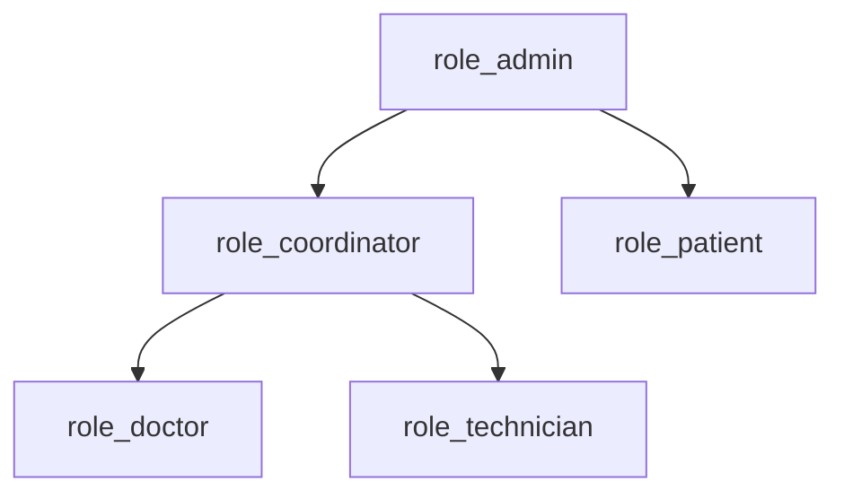

# Access control

<!-- Standard scoping (confirmed by Team lead): patient sees own journey only; doctor/technician see
     their own worklist and assigned patients; coordinator/admin see all. The AI agents are not
     roles - they act through the closed tool set (see NFR-SEC-13); this matrix governs humans. -->

## Roles

| Role (English, canonical) | Description | Held by (from [02](02-stakeholders.md)) | Assigned by |
|---------------------------|-------------|----------------------------------------|-------------|
| `role_patient` | Bệnh nhân dùng chat và theo dõi lộ trình của mình / Patient using chat and tracking their own pathway | Bệnh nhân / Patients | Tự đăng ký khi tiếp nhận (mô phỏng) / self-registered at intake (simulated) |
| `role_doctor` | Bác sĩ khám, chẩn đoán, chỉ định, xem worklist / Doctor who examines, diagnoses, orders, views worklist | Bác sĩ / Doctors | role_admin |
| `role_technician` | Kỹ thuật viên thực hiện dịch vụ và cập nhật task / Technician who performs services and updates tasks | Kỹ thuật viên / Technicians | role_admin |
| `role_coordinator` | Điều phối viên giám sát dashboard, duyệt re-plan / Coordinator monitoring the dashboard and approving re-plans | Điều phối viên / Coordinators | role_admin |
| `role_admin` | Quản trị hệ thống, cấu hình, seed simulator, đọc audit / System administrator | Quản trị / Administrators | role_admin (bootstrap) |

## Permission matrix

<!-- C R U D = create/read/update/delete. Scope in parentheses: (Own) records the user created or is
     assigned to; (Team) records in their department; (All) every record; - no access. -->

| Entity | `role_patient` | `role_doctor` | `role_technician` | `role_coordinator` | `role_admin` |
|--------|----------------|---------------|-------------------|--------------------|--------------|
| `Patient` | RU (Own) | R (Assigned) | R (Assigned) | R (All) | CRUD (All) |
| `IntakeSession` | CR (Own) | R (Assigned) | - | R (All) | CRUD (All) |
| `Appointment` | CRU (Own) | RU (Assigned) | R (Assigned) | CRUD (All) | CRUD (All) |
| `Diagnosis` | R (Own) | CRU (Assigned) | R (Assigned) | R (All) | R (All) |
| `ServiceOrder` | R (Own) | CRU (Assigned) | R (Assigned) | R (All) | R (All) |
| `CarePlan` | R (Own) | R (Assigned) | R (Assigned) | RU (All) | CRUD (All) |
| `Task` | R (Own) | RU (Own worklist) | RU (Own worklist) | RU (All) | CRUD (All) |
| `Slot` | R (Own) | R (Own worklist) | R (Own worklist) | RU (All) | CRUD (All) |
| `Payment` | CR (Own) | - | - | R (All) | R (All) |
| `Resource` | - | R (Team) | R (Team) | RU (All) | CRUD (All) |
| `DisruptionEvent` | - | R (Assigned) | R (Assigned) | RU (All) | CRUD (All) |
| `Notification` | R (Own) | R (Own) | R (Own) | R (All) | R (All) |
| `ScanEvent` | R (Own) | CR (Own worklist) | CR (Own worklist) | R (All) | CRUD (All) |
| `AuditLogEntry` | R (Own decisions about them) | R (Own) | - | R (All) | R (All) |
| `ServiceType` | R (All) | R (All) | R (All) | R (All) | CRUD (All) |

## Action permissions

| Action | Entity | Allowed roles | Condition | Requirement |
|--------|--------|---------------|-----------|-------------|
| Ký chỉ định / Sign order | `ServiceOrder` | `role_doctor` | Chỉ bác sĩ khám ca đó / only the examining doctor | [FR-03](05-functional-requirements.md#fr-03) |
| Thanh toán / Pay | `Payment` | `role_patient` | Cho task/khám của chính mình / for their own task or consult | [FR-05](05-functional-requirements.md#fr-05) |
| Duyệt/từ chối re-plan / Approve or reject re-plan | `DisruptionEvent` | `role_coordinator`, `role_admin` | Chỉ khi `PENDING_APPROVAL` / only when pending | [FR-09](05-functional-requirements.md#fr-09), [FR-12](05-functional-requirements.md#fr-12) |
| Cập nhật trạng thái task / Update task status | `Task` | `role_technician`, `role_doctor` | Chỉ task trong worklist của mình / only own-worklist tasks | [FR-06](05-functional-requirements.md#fr-06) |
| Quét mã cập nhật trạng thái / Scan patient code to update status | `Task` (qua `ScanEvent`) | `role_doctor`, `role_technician` | Chỉ owner của task; task không `LOCKED` / only the task owner, task not locked | [FR-17](05-functional-requirements.md#fr-17) |
| Sắp lại worklist qua chat / Reorder worklist via chat | `Slot` | `role_doctor` | Chỉ lịch của chính bác sĩ / only the doctor's own schedule | [FR-14](05-functional-requirements.md#fr-14) |
| Seed/cấu hình simulator / Seed or configure the simulator | `Resource`, `ServiceType` | `role_admin` | Môi trường demo / demo environment | [FR-12](05-functional-requirements.md#fr-12) |
| Đọc audit log / Read audit log | `AuditLogEntry` | `role_admin`, `role_coordinator` | role_coordinator chỉ đọc, không sửa / read-only | [FR-13](05-functional-requirements.md#fr-13) |

## Data scope rules

| Scope | Definition |
|-------|-----------|
| Own | `record.patient_id = user.patient_id` (bệnh nhân) hoặc `record.created_by = user.id` / patient's own records or records they created |
| Assigned | Bản ghi của bệnh nhân mà `care_plan.assigned_staff` chứa `user.id`, hoặc task có `task.owner_id = user.id` / records of patients whose care plan assigns this staff member, or tasks they own |
| Team | `resource.department_id = user.department_id` / records within the user's department |
| Own worklist | `task.owner_id = user.id` / tasks owned by the user |
| All | Mọi bản ghi trừ bản đã soft-delete (`deleted_at IS NULL`) / every record except soft-deleted |

## Authentication

| Question | Answer |
|----------|--------|
| Identity provider | Đăng nhập demo + phân quyền theo vai qua [FR-18](05-functional-requirements.md#fr-18) (tài khoản cục bộ/chọn vai); SSO/MFA thật là production - see [OI-11](11-assumptions-constraints.md#oi-11) / demo login and role gating via FR-18; real SSO/MFA is production |
| Session lifetime | Phiên demo hết hạn khi đóng simulator/run; giá trị production chưa chốt - [OI-11](11-assumptions-constraints.md#oi-11) / demo sessions end with the run |
| Multi-factor | Không áp dụng bản demo (không PHI thật); production yêu cầu cho staff - [OI-11](11-assumptions-constraints.md#oi-11) / n/a for the demo, required for staff in production |
| Service-to-service | Agent gọi tools trong tiến trình/qua bus nội bộ, không qua mạng công khai trong demo / agents call tools in-process or over an internal bus. See [09](09-integration-interface.md) |

## Role hierarchy

<!-- Inheritance shown is capability-only: role_admin can do everything a coordinator can. It does
     NOT mean role_admin inherits a patient's Own-scope data as their own - scope is always evaluated
     against the acting user. -->

## Auditing

| Action | Logged | Retention | Readable by |
|--------|--------|-----------|-------------|
| Quyết định của agent (re-plan, resequence) / Agent decisions | Yes | Vòng đời của run demo; production per [NFR-SEC-19](07-non-functional-requirements.md#nfr-security) | `role_admin`, `role_coordinator` |
| Duyệt/từ chối re-plan / Approve or reject | Yes | Như trên / as above | `role_admin`, `role_coordinator` |
| Ký chỉ định / Sign order | Yes | Như trên | `role_admin` |
| Thanh toán (mô phỏng) / Payment (simulated) | Yes | Như trên | `role_admin` |
| Action bị constraint checker chặn / Action blocked by the checker | Yes | Như trên | `role_admin`, `role_coordinator` |

## Open points

- Identity provider, session lifetime, MFA cho bản production chưa chốt - see [OI-11](11-assumptions-constraints.md#oi-11). / Production auth details undecided.
- Phạm vi chat worklist của bác sĩ (chỉ own hay cả khoa) cần xác nhận - see [OI-10](11-assumptions-constraints.md#oi-10). / Doctor worklist-chat scope to confirm.
