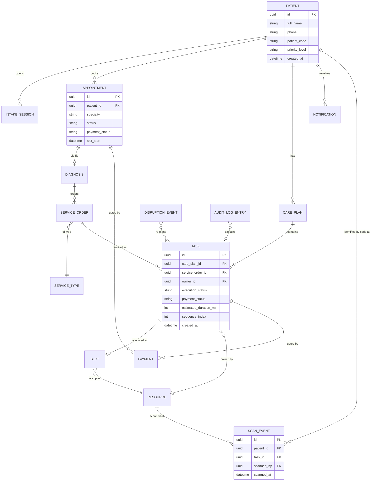
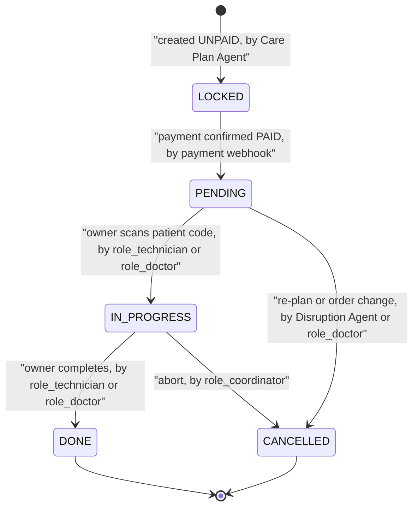
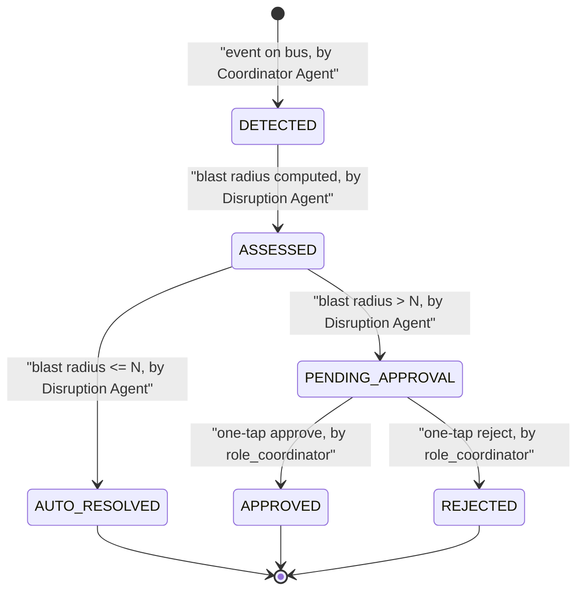

# Data model

<!-- Conceptual model only. Entity and field names are English; display labels may be Vietnamese.
     The phase boundary lives in the data too: a ServiceOrder is created only by a doctor (BR-05),
     and a Task derives from a ServiceOrder - never the reverse. -->

## Entity relationship diagram

<!-- Cardinality note: one ServiceOrder may realise as more than one Task (e.g. an order that has a
     prep step and a scan step). Where the input did not settle a cardinality it is marked below. -->

## Entities

| Entity | Represents | Owner (role) | Volume estimate | Retention |
|--------|-----------|--------------|-----------------|-----------|
| `Patient` | Bệnh nhân / A patient | `role_admin` | ~50-100/run | per [NFR-SEC-19](07-non-functional-requirements.md#nfr-security) |
| `IntakeSession` | Phiên hội thoại triage / A triage chat session | `role_patient` | 1+ per patient | per [NFR-SEC-19](07-non-functional-requirements.md#nfr-security) |
| `Appointment` | Buổi khám chẩn đoán / A diagnostic consult | `role_patient` | 1+ per patient | per [NFR-SEC-19](07-non-functional-requirements.md#nfr-security) |
| `Diagnosis` | Chẩn đoán của bác sĩ / A doctor's diagnosis | `role_doctor` | 0-1 per appointment | per [NFR-SEC-19](07-non-functional-requirements.md#nfr-security) |
| `ServiceOrder` | Chỉ định một dịch vụ / A single service order | `role_doctor` | 0-many per diagnosis | per [NFR-SEC-19](07-non-functional-requirements.md#nfr-security) |
| `ServiceType` | Loại dịch vụ và ràng buộc / A service type and its constraints | `role_admin` | Vài chục / dozens (catalog) | Cấu hình / config |
| `CarePlan` | Kế hoạch cá nhân hóa / A per-patient plan | `role_coordinator` | 0-1 per encounter | per [NFR-SEC-19](07-non-functional-requirements.md#nfr-security) |
| `Task` | Một bước dịch vụ / A single service step | `role_coordinator` | 0-many per care plan | per [NFR-SEC-19](07-non-functional-requirements.md#nfr-security) |
| `Slot` | Slot thời gian của một owner / A time slot for an owner | `role_coordinator` | 1 per task (khi xếp) | per run |
| `Payment` | Bản ghi cờ cho phép tiến hành (không xử lý tiền) / A proceed-gate flag record (no money processing) | `role_patient` | 1 per gated item | per [NFR-SEC-19](07-non-functional-requirements.md#nfr-security) |
| `ScanEvent` | Sự kiện quét mã bệnh nhân tại phòng / A patient-code scan at a room | `role_doctor` / `role_technician` | Nhiều / many | per run |
| `Resource` | Phòng/thiết bị/owner có capacity / A room, equipment, or staff owner | `role_admin` | Vài chục / dozens | Cấu hình / config |
| `DisruptionEvent` | Sự cố cần re-plan / A disruption needing re-plan | `role_coordinator` | Vài per run | per run |
| `Notification` | Thông báo tới bệnh nhân / A patient notification | system | Nhiều / many | per run |
| `AuditLogEntry` | Quyết định agent + reasoning / An agent decision and its reasoning | system | Nhiều / many | per [NFR-SEC-19](07-non-functional-requirements.md#nfr-security) |

## Data dictionary

### `Patient`

| Field | Type | Required | Classification | Description | Example |
|-------|------|----------|----------------|-------------|---------|
| `id` | uuid | Yes | Internal | Primary key | `9f1c...` |
| `full_name` | string | Yes | PII | Tên bệnh nhân (tổng hợp trong demo) / patient name | `Nguyen Van A` |
| `phone` | string | No | PII | Số điện thoại cho thông báo / contact for notifications | `090xxxxxxx` |
| `patient_code` | string | Yes | Internal | Mã định danh hiển thị trong app để quét (QR) / scannable patient code shown in the app | `VAIC-7F3A2` |
| `priority_level` | enum | Yes | Confidential | Mức ưu tiên lâm sàng / clinical priority - see [03](03-glossary.md) | `ROUTINE` |
| `created_at` | datetime | Yes | Internal | Thời điểm tạo / created time | `2026-07-17T08:00:00Z` |

**Constraints and invariants**

- `priority_level` chỉ nhận `ROUTINE`/`URGENT`/`EMERGENCY`; đặt bởi Intake, xác nhận bởi nhân viên (BR-02).
- `full_name` và `phone` bị loại khỏi mọi log theo [NFR-SEC-01](07-non-functional-requirements.md#nfr-security).

### `Appointment`

| Field | Type | Required | Classification | Description | Example |
|-------|------|----------|----------------|-------------|---------|
| `id` | uuid | Yes | Internal | Primary key | `a1...` |
| `patient_id` | uuid | Yes | Internal | FK -> `Patient` | `9f1c...` |
| `specialty` | string | Yes | Confidential | Chuyên khoa được định tuyến / routed specialty | `cardiology` |
| `status` | enum | Yes | Internal | Trạng thái buổi khám / consult status - see [03](03-glossary.md) | `BOOKED` |
| `payment_status` | enum | Yes | Internal | `UNPAID`/`PAID` (cổng thanh toán) | `PAID` |
| `slot_start` | datetime | Yes | Internal | Giờ bắt đầu slot / slot start | `2026-07-17T09:30:00Z` |

**Constraints and invariants**

- `status` chỉ chuyển theo state machine bên dưới - see BR liên quan [FR-03](05-functional-requirements.md#fr-03).
- Buổi khám chỉ `IN_CONSULT` khi `payment_status = PAID` (BR-10 mở rộng cho khám).

### `ServiceOrder`

| Field | Type | Required | Classification | Description | Example |
|-------|------|----------|----------------|-------------|---------|
| `id` | uuid | Yes | Internal | Primary key | `so1...` |
| `diagnosis_id` | uuid | Yes | Internal | FK -> `Diagnosis` | `dg1...` |
| `service_type_id` | uuid | Yes | Internal | FK -> `ServiceType` | `st1...` |
| `ordered_by` | uuid | Yes | Internal | FK -> bác sĩ ký / signing doctor | `dr1...` |
| `signed_at` | datetime | Yes | Internal | Thời điểm ký / signed time | `2026-07-17T09:50:00Z` |

**Constraints and invariants**

- Chỉ `role_doctor` tạo `ServiceOrder` (BR-05); không agent nào tạo được.
- `ordered_by` phải là bác sĩ khám buổi đó.

### `ServiceType`

| Field | Type | Required | Classification | Description | Example |
|-------|------|----------|----------------|-------------|---------|
| `id` | uuid | Yes | Internal | Primary key | `st1...` |
| `code` | string | Yes | Internal | Mã dịch vụ / service code | `BLOOD_TEST` |
| `display_label` | string | Yes | Internal | Nhãn hiển thị / display label | `Xet nghiem mau` |
| `requires_fasting` | bool | Yes | Internal | Có cần nhịn ăn / fasting required | `true` |
| `turnaround_minutes` | int | Yes | Internal | Thời gian trả kết quả / result turnaround | `45` |
| `default_duration_min` | int | Yes | Internal | Thời lượng mặc định / default duration | `10` |

**Constraints and invariants**

- `turnaround_minutes >= 0`; `default_duration_min > 0`.

### `CarePlan`

| Field | Type | Required | Classification | Description | Example |
|-------|------|----------|----------------|-------------|---------|
| `id` | uuid | Yes | Internal | Primary key | `cp1...` |
| `patient_id` | uuid | Yes | Internal | FK -> `Patient` | `9f1c...` |
| `diagnosis_id` | uuid | Yes | Internal | FK -> `Diagnosis` | `dg1...` |
| `status` | enum | Yes | Internal | `DRAFT`/`ACTIVE`/`COMPLETED` - see [03](03-glossary.md) | `ACTIVE` |
| `assigned_staff` | uuid[] | No | Internal | Nhân viên gán cho lộ trình / staff assigned (drives Assigned scope) | `[dr1..., kt1...]` |
| `created_at` | datetime | Yes | Internal | Tạo / created | `2026-07-17T09:55:00Z` |

**Constraints and invariants**

- Task của care plan chỉ sinh từ `ServiceOrder` của cùng `diagnosis_id` (BR-07).
- `status = COMPLETED` chỉ khi mọi `Task` là `DONE` hoặc `CANCELLED`.

### `Task`

| Field | Type | Required | Classification | Description | Example |
|-------|------|----------|----------------|-------------|---------|
| `id` | uuid | Yes | Internal | Primary key | `tk1...` |
| `care_plan_id` | uuid | Yes | Internal | FK -> `CarePlan` | `cp1...` |
| `service_order_id` | uuid | Yes | Internal | FK -> `ServiceOrder` nguồn | `so1...` |
| `owner_id` | uuid | Yes | Internal | FK -> `Resource` (bác sĩ/KTV/phòng) | `kt1...` |
| `execution_status` | enum | Yes | Internal | `PENDING`/`IN_PROGRESS`/`DONE`/`CANCELLED`/`LOCKED` | `PENDING` |
| `payment_status` | enum | Yes | Internal | `UNPAID`/`PAID` | `UNPAID` |
| `estimated_duration_min` | int | Yes | Internal | Thời lượng từ Forecast / forecast duration | `10` |
| `sequence_index` | int | Yes | Internal | Thứ tự trong care plan / order index | `2` |
| `depends_on` | uuid[] | No | Internal | Task phụ thuộc trước / prerequisite tasks | `[tk0...]` |
| `created_at` | datetime | Yes | Internal | Tạo / created | `2026-07-17T09:55:00Z` |

**Constraints and invariants**

- `payment_status = UNPAID` -> hiệu lực `LOCKED`: không vào hàng đợi, không tính tải/ETA (BR-10).
- `execution_status` chỉ chuyển theo state machine bên dưới.
- Không được đặt `sequence_index` vi phạm `depends_on` (BR-08, BR-13).

### `Payment`

<!-- Not a money-processing record: it is the proceed-gate flag. The app never touches funds
     (AS-02); actual payment happens outside the app. -->

| Field | Type | Required | Classification | Description | Example |
|-------|------|----------|----------------|-------------|---------|
| `id` | uuid | Yes | Internal | Primary key | `pm1...` |
| `subject_type` | enum | Yes | Internal | `TASK`/`APPOINTMENT` | `TASK` |
| `subject_id` | uuid | Yes | Internal | FK -> task/appointment | `tk1...` |
| `amount` | decimal | No | Confidential | Số tiền cần thanh toán để hiển thị (không xử lý) / amount to display only, not processed | `150000` |
| `status` | enum | Yes | Internal | Cờ `UNPAID`/`PAID` / the flag | `PAID` |
| `confirmed_by` | uuid | No | Internal | FK -> nguồn ủy quyền đánh dấu (nhân viên/hệ thống viện) / authorised source that marked it paid | `staff1...` |
| `confirmed_at` | datetime | No | Internal | Thời điểm cờ chuyển PAID / when the flag flipped | `2026-07-17T10:00:00Z` |

**Constraints and invariants**

- App không xử lý tiền; chỉ nguồn được ủy quyền chuyển `status = PAID` (BR-11). Cơ chế: nhân viên quét mã bệnh nhân (`patient_code`) tại quầy để xác nhận, ghi vào `confirmed_by`/`confirmed_at` (BR-36, [FR-05](05-functional-requirements.md#fr-05)) - khác với `ScanEvent` (hiện diện tại phòng, [FR-17](05-functional-requirements.md#fr-17)). Vai trò nhân viên cụ thể chưa chốt: [OI-19](11-assumptions-constraints.md#oi-19).

### `ScanEvent`

| Field | Type | Required | Classification | Description | Example |
|-------|------|----------|----------------|-------------|---------|
| `id` | uuid | Yes | Internal | Primary key | `sc1...` |
| `patient_id` | uuid | Yes | Internal | FK -> `Patient` (khớp `patient_code`) | `9f1c...` |
| `task_id` | uuid | Yes | Internal | FK -> `Task` được cập nhật / task updated | `tk1...` |
| `scanned_by` | uuid | Yes | Internal | FK -> `Resource` owner quét / scanning owner | `kt1...` |
| `scanned_at` | datetime | Yes | Internal | Thời điểm quét / scan time | `2026-07-17T10:10:00Z` |

**Constraints and invariants**

- `scanned_by` phải là owner của `task_id` (BR-26); không quét được task `LOCKED` (BR-27).
- Một quét hợp lệ chuyển `Task.execution_status` `PENDING` -> `IN_PROGRESS` ([FR-17](05-functional-requirements.md#fr-17)).

### `Resource`

| Field | Type | Required | Classification | Description | Example |
|-------|------|----------|----------------|-------------|---------|
| `id` | uuid | Yes | Internal | Primary key | `kt1...` |
| `type` | enum | Yes | Internal | `DOCTOR`/`TECHNICIAN`/`ROOM`/`EQUIPMENT` | `EQUIPMENT` |
| `department_id` | uuid | Yes | Internal | FK -> khoa (drives Team scope) | `dep1...` |
| `is_available` | bool | Yes | Internal | Đang hoạt động / available | `false` |
| `capacity_per_hour` | int | No | Internal | Capacity mô hình / capacity | `6` |

**Constraints and invariants**

- `allocate_slot()` không xếp vào `Resource` có `is_available = false` (BR-16).

### `DisruptionEvent`

| Field | Type | Required | Classification | Description | Example |
|-------|------|----------|----------------|-------------|---------|
| `id` | uuid | Yes | Internal | Primary key | `de1...` |
| `event_type` | enum | Yes | Internal | `EQUIPMENT_FAILURE`/`OVERLOAD`/`SCHEDULE_CHANGE`/`EMERGENCY` | `EQUIPMENT_FAILURE` |
| `status` | enum | Yes | Internal | `DETECTED`/`ASSESSED`/`AUTO_RESOLVED`/`PENDING_APPROVAL`/`APPROVED`/`REJECTED` | `PENDING_APPROVAL` |
| `blast_radius` | int | Yes | Internal | Số bệnh nhân ảnh hưởng / impacted count | `30` |
| `decided_by` | uuid | No | Internal | FK -> điều phối viên duyệt / approving coordinator | `co1...` |

**Constraints and invariants**

- `blast_radius > N` -> `status` phải qua `PENDING_APPROVAL` trước khi thực thi (BR-17); N tại [OI-03](11-assumptions-constraints.md#oi-03).

### `Notification`

| Field | Type | Required | Classification | Description | Example |
|-------|------|----------|----------------|-------------|---------|
| `id` | uuid | Yes | Internal | Primary key | `nt1...` |
| `patient_id` | uuid | Yes | Internal | FK -> `Patient` | `9f1c...` |
| `channel` | enum | Yes | Internal | `IN_APP`/`SCREEN`/`SMS` | `IN_APP` |
| `body` | string | Yes | Confidential | Nội dung (không dữ liệu bệnh nhân khác) / content, no cross-patient data | `Buoc ke: sieu am, ETA 10 phut` |
| `reason` | string | No | Confidential | Lý do khi re-plan / reason on re-plan | `May X-quang tam ngung` |
| `created_at` | datetime | Yes | Internal | Tạo / created | `2026-07-17T10:05:00Z` |

**Constraints and invariants**

- `body`/`reason` không được chứa dữ liệu của bệnh nhân khác ([FR-11](05-functional-requirements.md#fr-11) AC-11.2).

### `AuditLogEntry`

| Field | Type | Required | Classification | Description | Example |
|-------|------|----------|----------------|-------------|---------|
| `id` | uuid | Yes | Internal | Primary key | `al1...` |
| `actor` | string | Yes | Internal | Agent hoặc role người / agent or human role | `Disruption Agent` |
| `action` | string | Yes | Internal | Hành động / action taken | `resequence_patient` |
| `target_id` | uuid | No | Internal | FK -> đối tượng tác động / affected object | `tk1...` |
| `reasoning` | string | Yes | Confidential | Chain-of-thought / reasoning | `May 2 hang doi dai; day X-quang xuong sau` |
| `created_at` | datetime | Yes | Internal | Ghi / logged | `2026-07-17T10:05:00Z` |

**Constraints and invariants**

- Append-only; không actor nào sửa entry đã ghi (BR-23).

### `IntakeSession` and `Diagnosis` (summary)

- `IntakeSession`: `id`, `patient_id` (FK), `transcript` (Sensitive PII), `structured_triage` (JSON: specialty, priority_level, constraints; Confidential), `emergency_suspected` (bool, Confidential - cờ do Intake gắn khi nghi red-flag, [BF-05](04-business-flows.md)), `created_at`. Invariant: `transcript` là untrusted content ([NFR-SEC-11](07-non-functional-requirements.md#nfr-security)), không log; `emergency_suspected = true` chặn đặt slot thường cho tới khi nhân viên xác nhận ([FR-01](05-functional-requirements.md#fr-01)).
- `Diagnosis`: `id`, `appointment_id` (FK), `conditions` (Sensitive PII), `diagnosed_by` (FK bác sĩ), `created_at`. Invariant: chỉ `role_doctor` tạo/sửa (BR-05).

## State transitions

### `Task.execution_status`

| From | To | Trigger | Allowed role | Rule |
|------|----|---------|--------------|------|
| `LOCKED` | `PENDING` | Thanh toán xác nhận / payment confirmed | payment webhook | [BR-10](05-functional-requirements.md#fr-05), [BR-11](05-functional-requirements.md#fr-05) |
| `PENDING` | `IN_PROGRESS` | Owner quét mã bệnh nhân / owner scans patient code | `role_technician`, `role_doctor` | [FR-06](05-functional-requirements.md#fr-06), [FR-17](05-functional-requirements.md#fr-17) |
| `IN_PROGRESS` | `DONE` | Hoàn tất / complete | `role_technician`, `role_doctor` | [FR-06](05-functional-requirements.md#fr-06) |
| `PENDING`/`IN_PROGRESS` | `CANCELLED` | Re-plan/đổi chỉ định / re-plan or order change | Disruption Agent, `role_doctor`, `role_coordinator` | [BR-06](05-functional-requirements.md#fr-03), [BR-17](05-functional-requirements.md#fr-09) |

### `DisruptionEvent.status`

| From | To | Trigger | Allowed role | Rule |
|------|----|---------|--------------|------|
| `ASSESSED` | `AUTO_RESOLVED` | Ảnh hưởng <= N / impact <= N | Disruption Agent | [BR-17](05-functional-requirements.md#fr-09) |
| `ASSESSED` | `PENDING_APPROVAL` | Ảnh hưởng > N / impact > N | Disruption Agent | [BR-17](05-functional-requirements.md#fr-09) |
| `PENDING_APPROVAL` | `APPROVED`/`REJECTED` | Duyệt/từ chối / approve or reject | `role_coordinator` | [BR-22](05-functional-requirements.md#fr-12) |

## Persistence notes

| Question | Answer |
|----------|--------|
| Store | Redis cho state/events thời gian thực (proposal muc 6); store bền vững = PostgreSQL qua SQLAlchemy, DDL tại `src/vaic/state/sql/schemas.sql` - [OI-15](11-assumptions-constraints.md#oi-15) resolved (TASK-032) / Redis for real-time state and events; durable store = PostgreSQL via SQLAlchemy, DDL in `src/vaic/state/sql/schemas.sql` |
| Migration path | Không có - dữ liệu tạo trong-app/seed simulator, không migrate hệ thống cũ / none - data is created in-app or seeded |
| Soft delete | Dùng `deleted_at` cho bản ghi bệnh nhân để giữ audit; task hủy giữ ID (`CANCELLED`) / soft delete for patient records; cancelled tasks keep their ID |
| Auditing | `AuditLogEntry` cho quyết định agent và action đặc quyền, per [06](06-access-control.md) / audit for agent decisions and privileged actions |

## Data sources and migration

| Entity | Source at launch | Volume | Owner of the migration |
|--------|------------------|--------|------------------------|
| `Patient`, `Appointment`, `Task`... | Seed simulator (tổng hợp) / seeded synthetic data | ~50-100/run | `role_admin` |
| `ServiceType`, `Resource` | Cấu hình seed / seeded config | Vài chục / dozens | `role_admin` |

## Open points

- ~~Store bền vững ngoài Redis chưa chốt~~ - resolved (TASK-032): PostgreSQL via SQLAlchemy. See
  [OI-15](11-assumptions-constraints.md#oi-15), `src/vaic/state/sql/schemas.sql` (DDL, the source of
  truth), `src/vaic/state/sql/models.py` (SQLAlchemy models mirroring it). Not yet wired as a live
  `Repository` backend - only the schema exists so far; the app still runs on Redis by default.
- Cardinality `ServiceOrder` -> `Task` (1:1 hay 1:n) tùy loại dịch vụ có bước chuẩn bị; xác nhận với bác sĩ - [OI-16](11-assumptions-constraints.md#oi-16). / Order-to-task cardinality to confirm.
