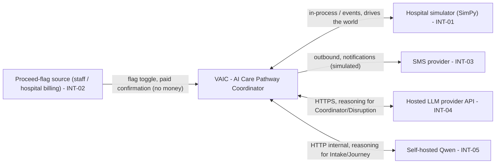

# Integration interface

<!-- Delivery is a hackathon demo on a simulator. The ONLY genuinely external integration is the
     hosted LLM provider API (INT-04). Everything else is simulated (INT-01, INT-02, INT-03) or
     self-hosted internal (INT-05). Real hospital-system integrations (HIS/EMR/LIS/PACS) are
     out of scope and recorded as future open issues, not designed here. -->

## Integration map

## Integration table

| ID | Interface | Direction | Protocol | Data exchanged | Auth | Frequency | Owner |
|----|-----------|-----------|----------|----------------|------|-----------|-------|
| INT-01 | Hospital simulator (SimPy) | Bidirectional | In-process / event bus (Redis) | Event stream, state snapshot / event stream, snapshot | Nội bộ tiến trình / in-process | Realtime | Đội thi / the team |
| INT-02 | Proceed-flag source (nhân viên/quầy hoặc billing viện) | Inbound | HTTP nội bộ / internal HTTP | Đánh dấu đã thanh toán {subject_id, status} - KHÔNG tiền / paid-flag toggle, no money | Nội bộ / internal | On demand | Đội thi (demo); billing viện (production) |
| INT-03 | SMS provider | Outbound | REST (mô phỏng / mocked) | Nội dung thông báo / notification body | API key (production) | On demand | Chưa chọn - [OI-17](11-assumptions-constraints.md#oi-17) |
| INT-04 | Hosted LLM provider API | Bidirectional | HTTPS (REST) | Prompt + completion cho Coordinator/Disruption / prompts and completions | API key | Realtime (batched) | Nhà cung cấp bên ngoài / external provider |
| INT-05 | Self-hosted Qwen | Bidirectional | HTTP nội bộ / internal HTTP | Prompt + completion cho Intake/Journey / prompts and completions | Nội bộ mạng / internal network | Realtime | Đội thi / the team |

## INT-04 Hosted LLM provider API

**Purpose**: Cung cấp năng lực suy luận mạnh cho Coordinator Agent và Disruption Agent. / Provides strong reasoning for the Coordinator and Disruption agents.
**Serves**: [FR-09](05-functional-requirements.md#fr-09), [FR-10](05-functional-requirements.md#fr-10)
**Owner of the far side**: Nhà cung cấp LLM bên ngoài; nhà cung cấp cụ thể chưa chốt - [OI-18](11-assumptions-constraints.md#oi-18) / external LLM provider, specific vendor undecided.

### Contract

| | Detail |
|---|---|
| Endpoint | Cung cấp theo môi trường (biến môi trường) / provided per environment via env var |
| Method / operation | Chat/completions với tool-calling / chat completions with tool-calling |
| Request payload | System prompt + snapshot (đã lọc PII) + tool schemas / system prompt, PII-filtered snapshot, tool schemas |
| Response payload | Tool calls + reasoning; chỉ dùng phần khớp schema / tool calls and reasoning, schema-validated |
| Data classification | Chỉ Internal/tổng hợp rời ranh giới trong demo; PII+ không gửi ra (bản demo dùng dữ liệu tổng hợp) / only Internal/synthetic leaves the boundary in the demo |
| Idempotency | Lời gọi suy luận không có side effect; side effect chỉ qua tools nội bộ có validation / reasoning calls have no side effects; effects only via validated internal tools |
| Rate limits | Theo provider; Coordinator batch event để không vượt / provider-defined; the Coordinator batches to stay under |

### Authentication

| | Detail |
|---|---|
| Mechanism | API key |
| Credential storage | Biến môi trường/secret store, không commit ([NFR-SEC-08](07-non-functional-requirements.md#nfr-security)) / env var or secret store, never committed |
| Rotation | Xoay được không đổi code; cadence chưa chốt - [OI-12](11-assumptions-constraints.md#oi-12) / rotatable without a code change |

### Failure behaviour

| Failure | System behaviour | User-visible effect | Data state |
|---------|------------------|---------------------|------------|
| Timeout | Retry ngắn có backoff, sau đó giữ trạng thái, không hành động bừa / short backoff retry, then hold | Lộ trình tạm không đổi, thông báo trung tính / pathway held, neutral notice | Consistent (không action nửa vời) / consistent |
| 4xx (rejected) | Không retry; log, cảnh báo điều phối viên / no retry, log, alert | Điều phối viên xử lý thủ công / coordinator handles manually | Consistent |
| 5xx (provider down) | Fallback: giảm phụ thuộc suy luận, giữ plan hiện tại, cảnh báo / degrade, hold plan, alert per [NFR-REL-04](07-non-functional-requirements.md#nfr-reliability) | Không re-plan tự động cho tới khi hồi phục / no auto re-plan until recovery | Consistent |
| Malformed response | Fail closed: bỏ qua output không khớp schema, không đoán / discard non-schema output, never guess ([NFR-SEC-12](07-non-functional-requirements.md#nfr-security)) | Không thay đổi trạng thái / no state change | Consistent |

### Environment availability

| Environment | Available | Notes |
|-------------|-----------|-------|
| Development | Yes | API key demo; hoặc dùng INT-05 self-hosted để giảm chi phí / demo key, or fall back to self-hosted |
| Staging | N/A | Không có staging cho bản demo / no staging for the demo |
| Production | Unknown | Phụ thuộc quyết định triển khai production - [OI-18](11-assumptions-constraints.md#oi-18) / depends on production decision |

## INT-02 Proceed-flag source (paid flag, no money)

**Purpose**: Đánh dấu bệnh nhân đã thanh toán (ngoài app) để mở khóa task/khám ([FR-05](05-functional-requirements.md#fr-05)). App KHÔNG xử lý tiền. / Marks a patient as paid (paid outside the app) to unlock a task or consult. The app processes no money.
**Serves**: [FR-05](05-functional-requirements.md#fr-05)
**Owner of the far side**: Nhân viên/quầy đánh dấu trong demo; hệ thống billing viện là production - [OI-19](11-assumptions-constraints.md#oi-19) / staff marks it in the demo; hospital billing is the production source.

### Contract

| | Detail |
|---|---|
| Endpoint | Endpoint nội bộ đánh dấu cờ / internal flag-toggle endpoint |
| Request payload | `{subject_type, subject_id, status: PAID}` - không trường tiền / no money field |
| Response payload | 200 ack |
| Idempotency | Trùng lời gọi cho cùng `subject_id` không đổi kết quả / idempotent per `subject_id` |
| Data classification | Internal (chỉ cờ trạng thái, không dữ liệu tài chính) / a status flag only, no financial data |

### Failure behaviour

| Failure | System behaviour | User-visible effect | Data state |
|---------|------------------|---------------------|------------|
| Không nhận xác nhận / missing confirmation | Task giữ `LOCKED`, Journey Agent nhắc "vui lòng đi thanh toán" / task stays locked, reminder | Bệnh nhân được nhắc đi thanh toán / patient reminded to pay | Consistent (locked) |
| Xác nhận trùng / duplicate | Bỏ qua an toàn (idempotent) / safely ignored | Không / none | Consistent |

## Interfaces this system exposes

| ID | Endpoint | Consumer | Auth | Data returned | Rate limit |
|----|----------|----------|------|---------------|------------|
| API-01 | Chat/timeline API cho giao diện bệnh nhân / patient chat and timeline API | Frontend bệnh nhân / patient frontend | Phiên người dùng / user session | Lộ trình, ETA, thông báo (scope Own) / pathway, ETA, notifications | Theo phiên / per session |
| API-02 | Dashboard/approval API | Frontend điều phối viên / coordinator frontend | Phiên người dùng / user session | Snapshot tải, đề xuất re-plan (scope All) / load snapshot, re-plan proposals | Theo phiên / per session |
| API-03 | WebSocket stream reasoning + heatmap | Frontend điều phối viên | Phiên người dùng | Stream chain-of-thought + tải / reasoning and load stream | Realtime |

## Open points

- Nhà cung cấp LLM API cụ thể và điều khoản lưu trữ chưa chốt - [OI-02](11-assumptions-constraints.md#oi-02), [OI-18](11-assumptions-constraints.md#oi-18). / LLM vendor and retention terms undecided.
- Nhà cung cấp SMS thật là production, chưa chọn - [OI-17](11-assumptions-constraints.md#oi-17). / Real SMS vendor undecided.
- Nguồn đặt cờ đã thanh toán (nhân viên đánh dấu vs tích hợp billing viện) chưa chốt - [OI-19](11-assumptions-constraints.md#oi-19). App không xử lý tiền. / How the paid flag is set (staff vs hospital billing) undecided; the app never processes money.
- Tích hợp HIS/EMR/LIS/PACS thật hoàn toàn ngoài phạm vi bản demo - see [11](11-assumptions-constraints.md). / Real hospital-system integrations are out of scope.
