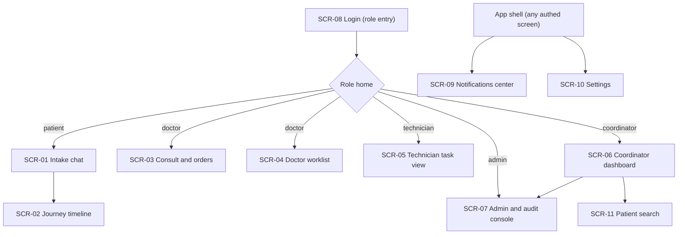

# UI/UX wireframes

<!-- The patient surface is chat + timeline (not forms). The coordinator surface is a heatmap +
     approval queue with streamed reasoning. Model-produced content (slot proposals, re-plan reasons)
     must be labelled as generated - NFR-USE-05.

     The app is ONE responsive, role-gated web app (FR-18): patient views mobile-first, staff and
     coordinator views desktop-first, one login, role-based routing. See 01 "App concept and platform".
     A lightweight visual design direction is in "Visual design direction" below; pixel specs still
     belong to build-time design. -->

## Screen inventory

| ID | Screen | Actor | Serves | Entry point |
|----|--------|-------|--------|-------------|
| SCR-01 | Chat tiếp nhận / Intake chat | `role_patient` | [FR-01](05-functional-requirements.md#fr-01), [FR-02](05-functional-requirements.md#fr-02) | Trang đầu bệnh nhân / patient landing |
| SCR-02 | Timeline lộ trình / Journey timeline | `role_patient` | [FR-04](05-functional-requirements.md#fr-04), [FR-05](05-functional-requirements.md#fr-05), [FR-06](05-functional-requirements.md#fr-06), [FR-11](05-functional-requirements.md#fr-11), [FR-15](05-functional-requirements.md#fr-15), [FR-17](05-functional-requirements.md#fr-17) | Sau khi có care plan / after a care plan exists |
| SCR-03 | Màn khám và chỉ định / Consult and orders | `role_doctor` | [FR-03](05-functional-requirements.md#fr-03), [FR-17](05-functional-requirements.md#fr-17) | Từ danh sách bệnh nhân chờ khám / from the consult queue |
| SCR-04 | Worklist bác sĩ / Doctor worklist | `role_doctor` | [FR-08](05-functional-requirements.md#fr-08), [FR-14](05-functional-requirements.md#fr-14) | Điều hướng chính bác sĩ / doctor nav |
| SCR-05 | Màn task kỹ thuật viên / Technician task view | `role_technician` | [FR-06](05-functional-requirements.md#fr-06), [FR-17](05-functional-requirements.md#fr-17) | Điều hướng chính KTV / technician nav |
| SCR-06 | Dashboard điều phối / Coordinator dashboard | `role_coordinator` | [FR-09](05-functional-requirements.md#fr-09), [FR-10](05-functional-requirements.md#fr-10), [FR-12](05-functional-requirements.md#fr-12) | Điều hướng chính điều phối viên / coordinator nav |
| SCR-07 | Console quản trị và audit / Admin and audit console | `role_admin` | [FR-13](05-functional-requirements.md#fr-13) | Điều hướng quản trị / admin nav |
| SCR-08 | Đăng nhập / Login (role entry) | all roles | [FR-18](05-functional-requirements.md#fr-18) | Cửa vào app / app entry |
| SCR-09 | Trung tâm thông báo / Notifications center | `role_patient` (+ staff) | [FR-20](05-functional-requirements.md#fr-20) | App shell |
| SCR-10 | Cài đặt / Settings (ngôn ngữ) | all roles | [FR-21](05-functional-requirements.md#fr-21) | App shell |
| SCR-11 | Tìm bệnh nhân / Patient search | `role_coordinator` | [FR-22](05-functional-requirements.md#fr-22) | Staff nav |

## Navigation



## SCR-01 Intake chat

**Actor**: `role_patient` (see [06](06-access-control.md))
**Serves**: [FR-01](05-functional-requirements.md#fr-01), [FR-02](05-functional-requirements.md#fr-02)
**Entities shown**: `IntakeSession`, `Appointment` (see [08](08-data-model.md))
**Related**: patient-app IA and feature detail behind this screen -
[PRD-FR-12 patient mobile app](../requirements/PRD-FR-12-patient-mobile-app.md#31-screen-sitemap)

### Layout

```
+--------------------------------------------------+
| Header: VAIC - tiep nhan                         |
+--------------------------------------------------+
| Chat stream (patient <-> Intake Agent)           |
|                                                  |
+--------------------------------------------------+
| Proposed slots (ranked by load, each with ETA)   |
+--------------------------------------------------+
| Message input                                    |
+--------------------------------------------------+
```

### Elements

| Element | Type | Bound to | Behaviour | Visible to |
|---------|------|----------|-----------|------------|
| Ô nhập tin nhắn / message input | input | - | Gửi tin nhắn cho Intake Agent / sends to Intake Agent | `role_patient` |
| Bong bóng chat / chat bubbles | table | `IntakeSession.transcript` | Hiển thị hội thoại / shows conversation | `role_patient` |
| Danh sách slot đề xuất / proposed slots | select | `Appointment` | Chọn slot -> `BOOKED`; validate còn capacity ([FR-02](05-functional-requirements.md#fr-02)) | `role_patient` |
| Nút đặt lịch / book button | button | - | Chốt slot; không đảo phase (không sinh chỉ định) / books; never generates orders | `role_patient` |

### States

| State | What the user sees |
|-------|--------------------|
| Empty (chưa chat) | Lời chào và gợi ý "Mô tả triệu chứng của bạn" / greeting and prompt |
| Loading | Chỉ báo "Đang xử lý..." khi agent suy luận, kèm timeout / thinking indicator with timeout |
| Error | Thông báo nêu bước tiếp theo ([NFR-USE-04](07-non-functional-requirements.md#nfr-usability)); nếu Forecast lỗi, slot gắn cờ "chưa có dự báo tải" |
| No permission | Không áp dụng (public cho bệnh nhân) / n/a |
| Success | Xác nhận đã đặt buổi khám chẩn đoán, chuyển sang SCR-02 sau khi khám / consult booked |

### Model-assisted elements

| Element | What the model produced | How it is labelled | How the user corrects it |
|---------|------------------------|--------------------|--------------------------|
| Slot đề xuất / proposed slots | Đề xuất khung giờ ít đông / low-load slot suggestions | Gắn nhãn "Đề xuất bởi AI" / labelled AI-suggested | Chọn slot khác hoặc yêu cầu khung khác / pick another or ask |
| Phân loại chuyên khoa / specialty guess | Chuyên khoa nghi ngờ / suspected specialty | Hiển thị để nhân viên xác nhận, không tự chốt / shown for staff confirmation | Nhân viên sửa tại quầy ([FR-01](05-functional-requirements.md#fr-01)) |

- Waiting behaviour: hiển thị "đang xử lý" với timeout; quá hạn -> gợi ý thử lại / thinking with timeout.
- Failure behaviour: nếu model không trích được triage -> hỏi thêm hoặc mời gặp nhân viên / ask more or hand to staff.

## SCR-02 Journey timeline

**Actor**: `role_patient`
**Serves**: [FR-04](05-functional-requirements.md#fr-04), [FR-05](05-functional-requirements.md#fr-05), [FR-06](05-functional-requirements.md#fr-06), [FR-11](05-functional-requirements.md#fr-11), [FR-15](05-functional-requirements.md#fr-15)
**Entities shown**: `CarePlan`, `Task`, `Notification`, `Payment`
**Related**: patient-app IA and feature detail behind this screen -
[PRD-FR-12 patient mobile app](../requirements/PRD-FR-12-patient-mobile-app.md#5-user-flow)

### Layout

```
+--------------------------------------------------+
| Header: Lo trinh cua ban - buoc ke: <task>       |
+--------------------------------------------------+
| Timeline of tasks (done / in-progress / pending) |
|   each task: owner, ETA, payment state, status   |
+--------------------------------------------------+
| Pay button on locked tasks                       |
+--------------------------------------------------+
| Chat with Journey Agent                          |
+--------------------------------------------------+
```

### Elements

| Element | Type | Bound to | Behaviour | Visible to |
|---------|------|----------|-----------|------------|
| Timeline task | table | `Task` | Hiển thị owner, ETA, trạng thái; task `LOCKED` hiện khóa / shows owner, ETA, status | `role_patient` (Own) |
| Nhắc thanh toán / go-pay reminder | button | `Payment` | Hiển thị "vui lòng đi thanh toán" trên task `LOCKED`; app không xử lý tiền ([FR-05](05-functional-requirements.md#fr-05)) | `role_patient` (Own) |
| Mã bệnh nhân (QR) / patient code | display | `Patient.patient_code` | Xuất trình để owner quét tại phòng ([FR-17](05-functional-requirements.md#fr-17)) | `role_patient` (Own) |
| Chat Journey Agent | input | `Notification` | Hỏi/đổi lộ trình; nội dung là dữ liệu / ask or adjust; chat is data | `role_patient` (Own) |
| Lý do re-plan / re-plan reason | text | `Notification.reason` | Hiển thị lý do khi thứ tự đổi ([FR-11](05-functional-requirements.md#fr-11)) | `role_patient` (Own) |
| Đổi / hủy lịch / reschedule-cancel | button | `Appointment` | Đổi khung giờ hoặc hủy buổi khám của chính mình ([FR-19](05-functional-requirements.md#fr-19)); xác nhận cho hủy | `role_patient` (Own) |

### States

| State | What the user sees |
|-------|--------------------|
| Empty | "Chưa có lộ trình - vui lòng hoàn tất khám chẩn đoán" / no plan yet |
| Loading | Skeleton timeline khi tải / skeleton |
| Error | Thông báo và cách xử lý ([NFR-USE-04](07-non-functional-requirements.md#nfr-usability)) |
| No permission | Không thấy lộ trình bệnh nhân khác (scope Own) / other patients hidden |
| Success | Task chuyển `DONE`, timeline tiến; hoàn tất -> tổng kết / task done, timeline advances |

### Model-assisted elements

| Element | What the model produced | How it is labelled | How the user corrects it |
|---------|------------------------|--------------------|--------------------------|
| Đề xuất đổi thứ tự / reorder suggestion | Journey Agent hoán đổi bước / step reordering | Gắn nhãn "AI đề xuất" kèm lý do / labelled with reason | Bệnh nhân chat phản hồi / chat back |
| Trả lời chat / chat replies | Câu trả lời của Journey Agent / agent replies | Rõ là trợ lý AI / clearly the AI assistant | Hỏi lại / ask again |

- Waiting behaviour: chỉ báo "đang cập nhật lộ trình" / updating indicator.
- Failure behaviour: giữ thứ tự hiện tại, thông báo trung tính nếu model lỗi / hold order on failure.

## SCR-03 Consult and orders

**Actor**: `role_doctor`
**Serves**: [FR-03](05-functional-requirements.md#fr-03)
**Entities shown**: `Diagnosis`, `ServiceOrder`, `IntakeSession` (tham khảo / reference)

### Layout

```
+--------------------------------------------------+
| Patient summary + Intake triage (reference only) |
+--------------------------------------------------+
| Diagnosis entry (conditions)                     |
+--------------------------------------------------+
| Service orders (add from ServiceType catalog)    |
+--------------------------------------------------+
| Sign and finalise                                |
+--------------------------------------------------+
```

### Elements

| Element | Type | Bound to | Behaviour | Visible to |
|---------|------|----------|-----------|------------|
| Triage tham khảo / reference triage | text | `IntakeSession.structured_triage` | Chỉ đọc, gắn nhãn "AI tham khảo" / read-only, labelled reference | `role_doctor` (Assigned) |
| Nhập chẩn đoán / diagnosis entry | input | `Diagnosis.conditions` | Bác sĩ nhập; bắt buộc trước khi chỉ định / required first | `role_doctor` (Assigned) |
| Thêm chỉ định / add order | select | `ServiceOrder`, `ServiceType` | Chọn từ catalog; chỉ bác sĩ / doctor only ([BR-05](05-functional-requirements.md#fr-03)) | `role_doctor` (Assigned) |
| Ký và chốt / sign and finalise | button | `ServiceOrder.signed_at` | Ký -> kích [FR-04](05-functional-requirements.md#fr-04) | `role_doctor` (Assigned) |
| Quét mã bệnh nhân / scan patient code | button | `ScanEvent` | Quét khi bệnh nhân đến để xác nhận có mặt và cập nhật trạng thái ([FR-17](05-functional-requirements.md#fr-17)) | `role_doctor` (Own worklist) |

### States

| State | What the user sees |
|-------|--------------------|
| Empty | Form khám trống với triage tham khảo / empty form with reference triage |
| Loading | Tải hồ sơ bệnh nhân / loading record |
| Error | Thông báo lỗi và cách xử lý |
| No permission | Không thấy bệnh nhân ngoài Assigned / non-assigned hidden |
| Success | Chẩn đoán và chỉ định đã ký, care plan bắt đầu sinh / signed, plan generating |

### Model-assisted elements

| Element | What the model produced | How it is labelled | How the user corrects it |
|---------|------------------------|--------------------|--------------------------|
| Triage tham khảo / reference triage | Phân loại của Intake Agent / Intake classification | "AI tham khảo - không phải chẩn đoán" / reference, not diagnosis | Bác sĩ bỏ qua/ghi đè hoàn toàn / doctor overrides freely |

- Waiting behaviour: n/a (nhập thủ công) / manual entry.
- Failure behaviour: n/a (không model trong bước quyết định) / no model in the decision step.

## SCR-04 Doctor worklist

**Actor**: `role_doctor`
**Serves**: [FR-08](05-functional-requirements.md#fr-08), [FR-14](05-functional-requirements.md#fr-14)
**Entities shown**: `Slot`, `Appointment`, `Task`

### Layout

```
+--------------------------------------------------+
| Today's worklist (slots, tasks)                  |
+--------------------------------------------------+
| Chat: rearrange my day (FR-14, Could)            |
+--------------------------------------------------+
```

### Elements

| Element | Type | Bound to | Behaviour | Visible to |
|---------|------|----------|-----------|------------|
| Danh sách slot/task / worklist | table | `Slot`, `Task` | Hiển thị lịch của chính bác sĩ (Own worklist) / own schedule | `role_doctor` (Own worklist) |
| Chat worklist | input | `Slot` | Yêu cầu sắp lại lịch của chính mình ([FR-14](05-functional-requirements.md#fr-14)); nội dung là dữ liệu | `role_doctor` (Own worklist) |

### States

| State | What the user sees |
|-------|--------------------|
| Empty | "Chưa có ca hôm nay" / no cases today |
| Loading | Skeleton worklist |
| Error | Thông báo và cách xử lý |
| No permission | Không thấy worklist bác sĩ khác / other doctors hidden |
| Success | Lịch được sắp lại và xác nhận / rearranged and confirmed |

### Model-assisted elements

| Element | What the model produced | How it is labelled | How the user corrects it |
|---------|------------------------|--------------------|--------------------------|
| Kết quả sắp lịch qua chat / chat reorder result | Đề xuất sắp lại worklist / worklist rearrangement | "AI sắp lại - xác nhận?" / AI rearranged, confirm | Bác sĩ xác nhận/hủy / confirm or cancel |

- Waiting behaviour: chỉ báo đang xử lý / thinking indicator.
- Failure behaviour: giữ lịch hiện tại nếu model lỗi / hold on failure.

## SCR-05 Technician task view

**Actor**: `role_technician`
**Serves**: [FR-06](05-functional-requirements.md#fr-06)
**Entities shown**: `Task`

### Layout

```
+--------------------------------------------------+
| Queue of tasks assigned to this technician       |
|   each: patient ref, service, start, status      |
+--------------------------------------------------+
```

### Elements

| Element | Type | Bound to | Behaviour | Visible to |
|---------|------|----------|-----------|------------|
| Hàng đợi task / task queue | table | `Task` | Chỉ task Own worklist; task `LOCKED` không hiện / own-worklist tasks; locked hidden | `role_technician` (Own worklist) |
| Quét mã bệnh nhân / scan patient code | button | `ScanEvent` | Quét khi bệnh nhân đến -> `IN_PROGRESS` ([FR-17](05-functional-requirements.md#fr-17)); task `LOCKED` không quét được | `role_technician` (Own worklist) |
| Nút hoàn tất / complete | button | `Task.execution_status` | `IN_PROGRESS`->`DONE` ([FR-06](05-functional-requirements.md#fr-06)) | `role_technician` (Own worklist) |

### States

| State | What the user sees |
|-------|--------------------|
| Empty | "Không có task nào đang chờ" / no pending tasks |
| Loading | Skeleton queue |
| Error | Thông báo và cách xử lý |
| No permission | Không thấy task ngoài worklist / non-owned hidden |
| Success | Task chuyển `DONE`, rời hàng đợi / task done, leaves queue |

## SCR-06 Coordinator dashboard

**Actor**: `role_coordinator`
**Serves**: [FR-09](05-functional-requirements.md#fr-09), [FR-10](05-functional-requirements.md#fr-10), [FR-12](05-functional-requirements.md#fr-12)
**Entities shown**: `Resource`, `DisruptionEvent`, `AuditLogEntry`

### Layout

```
+--------------------------------------------------+
| Load heatmap by area (real-time)                 |
+--------------------------------------------------+
| Approval queue: re-plan proposals                |
|   each: blast radius, options, approve / reject  |
+--------------------------------------------------+
| Live reasoning stream (Disruption Agent)         |
+--------------------------------------------------+
```

### Elements

| Element | Type | Bound to | Behaviour | Visible to |
|---------|------|----------|-----------|------------|
| Heatmap tải / load heatmap | table | `Resource` | Cập nhật thời gian thực ([NFR-PERF-04](07-non-functional-requirements.md#nfr-performance)) | `role_coordinator`, `role_admin` (All) |
| Hàng chờ duyệt / approval queue | table | `DisruptionEvent` | Hiện đề xuất ảnh hưởng > N / large-impact proposals | `role_coordinator`, `role_admin` |
| Nút duyệt/từ chối / approve-reject | button | `DisruptionEvent.status` | Một chạm, ghi audit ([BR-22](05-functional-requirements.md#fr-12)) | `role_coordinator`, `role_admin` |
| Stream reasoning | text | `AuditLogEntry.reasoning` | Stream chain-of-thought khi agent suy luận / live reasoning | `role_coordinator`, `role_admin` |

### States

| State | What the user sees |
|-------|--------------------|
| Empty | Heatmap bình thường, không đề xuất chờ / calm heatmap, no proposals |
| Loading | Skeleton heatmap |
| Error | Thông báo; nếu LLM lỗi, hiện cảnh báo "điều phối tự động tạm dừng" / auto-coordination paused |
| No permission | Bệnh nhân/bác sĩ/KTV không truy cập ([FR-12](05-functional-requirements.md#fr-12) AC-12.2) / non-coordinators blocked |
| Success | Đề xuất được duyệt/từ chối, heatmap dịu dần / proposals resolved, heatmap eases |

### Model-assisted elements

| Element | What the model produced | How it is labelled | How the user corrects it |
|---------|------------------------|--------------------|--------------------------|
| Đề xuất re-plan / re-plan proposal | Phương án của Disruption Agent / disruption options | Gắn nhãn AI kèm blast radius và lý do / labelled with impact and reason | Duyệt/từ chối/điều chỉnh / approve, reject |
| Stream reasoning | Chain-of-thought / reasoning | Rõ là suy luận AI / clearly AI reasoning | Chỉ đọc / read-only |

- Waiting behaviour: stream hiển thị tiến trình suy luận / reasoning streams as it runs.
- Failure behaviour: nếu model lỗi, giữ plan hiện tại, cảnh báo điều phối viên / hold and alert.

## SCR-07 Admin and audit console

**Actor**: `role_admin`
**Serves**: [FR-13](05-functional-requirements.md#fr-13)
**Entities shown**: `AuditLogEntry`, `ServiceType`, `Resource`

### Layout

```
+--------------------------------------------------+
| Audit log search (by patient, actor, action)     |
+--------------------------------------------------+
| Simulator seed and config (ServiceType, Resource)|
+--------------------------------------------------+
```

### Elements

| Element | Type | Bound to | Behaviour | Visible to |
|---------|------|----------|-----------|------------|
| Tìm audit / audit search | input | `AuditLogEntry` | Truy vấn theo bệnh nhân/actor/action; chỉ đọc (append-only) | `role_admin` |
| Cấu hình simulator / sim config | table | `ServiceType`, `Resource` | Seed/cấu hình môi trường demo / seed and configure | `role_admin` |

### States

| State | What the user sees |
|-------|--------------------|
| Empty | "Chưa có bản ghi audit" / no audit entries |
| Loading | Skeleton |
| Error | Thông báo và cách xử lý |
| No permission | Chỉ `role_admin` (và đọc audit cho `role_coordinator`) / admin only |
| Success | Kết quả audit hiển thị; cấu hình được lưu / results shown, config saved |

## SCR-08 Login (role entry)

**Actor**: all roles
**Serves**: [FR-18](05-functional-requirements.md#fr-18)
**Entities shown**: session

### Layout

```
+--------------------------------------------------+
| VAIC logo + one-line purpose                     |
+--------------------------------------------------+
| Login form (demo: account or role selector)      |
+--------------------------------------------------+
| Language toggle (VI / EN)                        |
+--------------------------------------------------+
```

### Elements

| Element | Type | Bound to | Behaviour | Visible to |
|---------|------|----------|-----------|------------|
| Đăng nhập / login | input + button | session | Xác thực, tạo phiên, định tuyến theo vai ([FR-18](05-functional-requirements.md#fr-18)) | public |
| Chuyển ngôn ngữ / language toggle | select | user pref | VI/EN ([FR-21](05-functional-requirements.md#fr-21)) | public |

### States

| State | What the user sees |
|-------|--------------------|
| Empty | Form đăng nhập trống / empty login |
| Loading | Đang đăng nhập / signing in |
| Error | Sai thông tin - thông báo rõ, không tiết lộ tài khoản tồn tại hay không / invalid credentials, no account enumeration |
| Success | Chuyển tới trang chủ theo vai / lands on the role home |

## SCR-09 Notifications center

**Actor**: `role_patient` (+ staff for their own)
**Serves**: [FR-20](05-functional-requirements.md#fr-20)
**Entities shown**: `Notification`

### Elements

| Element | Type | Bound to | Behaviour | Visible to |
|---------|------|----------|-----------|------------|
| Danh sách thông báo / notifications list | table | `Notification` | Phân trang, đã đọc/chưa đọc, lọc theo loại; chỉ của chính mình ([FR-20](05-functional-requirements.md#fr-20)) | Own |
| Đánh dấu đã đọc / mark read | button | `Notification` | Cập nhật trạng thái đã đọc | Own |

### States

| State | What the user sees |
|-------|--------------------|
| Empty | "Chưa có thông báo" / none yet |
| Loading | Skeleton |
| Error | Thông báo và cách xử lý / message and next step |
| No permission | Không thấy thông báo của người khác / others hidden |
| Success | Danh sách cập nhật / updated list |

## SCR-10 Settings

**Actor**: all roles
**Serves**: [FR-21](05-functional-requirements.md#fr-21)
**Entities shown**: user preferences

### Elements

| Element | Type | Bound to | Behaviour | Visible to |
|---------|------|----------|-----------|------------|
| Ngôn ngữ / language | select | user pref | VI/EN; đổi nhãn hiển thị, codes giữ tiếng Anh ([FR-21](05-functional-requirements.md#fr-21)) | self |
| Kênh thông báo / notification channel | select | user pref | in-app / SMS (SMS mô phỏng - [FR-15](05-functional-requirements.md#fr-15)) | self |
| Đăng xuất / logout | button | session | Kết thúc phiên ([FR-18](05-functional-requirements.md#fr-18)) | self |

### States

| State | What the user sees |
|-------|--------------------|
| Empty | Cài đặt mặc định / defaults |
| Loading | - |
| Error | Lựa chọn không hợp lệ bị từ chối / invalid choice rejected |
| Success | Áp dụng ngay, xác nhận đã lưu / applied and saved |

## SCR-11 Patient search

**Actor**: `role_coordinator` (doctors/technicians within their scope)
**Serves**: [FR-22](05-functional-requirements.md#fr-22)
**Entities shown**: `Patient`

### Elements

| Element | Type | Bound to | Behaviour | Visible to |
|---------|------|----------|-----------|------------|
| Ô tìm kiếm / search box | input | `Patient` | Tìm theo tên / `patient_code`; kết quả lọc theo scope ([FR-22](05-functional-requirements.md#fr-22)) | `role_coordinator` (All), `role_doctor`/`role_technician` (Assigned) |
| Kết quả / results | table | `Patient` | Mở lộ trình/worklist của bệnh nhân trong scope | scope-limited |

### States

| State | What the user sees |
|-------|--------------------|
| Empty | "Nhập tên hoặc mã bệnh nhân" / prompt |
| Loading | Skeleton |
| Error | Thông báo và cách xử lý |
| No permission | Bệnh nhân ngoài scope không xuất hiện / out-of-scope patients absent |
| Success | Danh sách khớp trong scope / matches within scope |

## Visual design direction

<!-- A lightweight design system so the UI reads as ONE product and earns the AI-Native UX & Design
     Thinking criterion (15 pts). This is a direction, not pixel specs; frontend-ui-dev refines it. -->

VI: Hướng thiết kế nhẹ để toàn app đọc như một sản phẩm thống nhất, phục vụ tiêu chí UX (15 điểm).

EN: A lightweight design system so the whole app reads as one product, serving the UX criterion.

Patient-surface nuance (register, colour, typography, one-handed use) is elaborated in
[PRD-FR-12 patient mobile app, section 6](../requirements/PRD-FR-12-patient-mobile-app.md#6-technical-constraints);
this section remains the app-wide contract and governs where the two differ.

| Aspect | Direction |
|--------|-----------|
| Component kit | Tailwind CSS + shadcn/ui (accessible primitives); no bespoke component where a kit one exists |
| Palette | Calm clinical base (neutral grey/white surfaces) + one trustworthy primary (teal/blue); semantic status colours: green = done/available, amber = waiting/pending, red = disruption/blocked, blue = in-progress. Load heatmap uses a sequential green->amber->red scale |
| Typography | One humanist sans (e.g. Inter), 3-4 sizes, generous line-height; numbers (ETA, queue) tabular |
| Tone / voice | Reassuring, plain Vietnamese; short sentences; the Journey Agent speaks like a helpful escort, never clinical jargon (NFR-USE-01, NFR-USE-04) |
| AI-content treatment | Model-produced content (slot suggestions, re-plan reasons, chat replies) carries a consistent "AI" chip/label and a subtle accent, always distinguishable from confirmed facts (NFR-USE-05) |
| Signature surfaces | (1) patient chat + vertical timeline with status-coloured step chips; (2) coordinator load heatmap + approval queue with a live reasoning stream; (3) the disruption "golden moment" - streamed chain-of-thought styled as calm, readable reasoning |
| Motion | Subtle and purposeful: timeline advance, heatmap easing, streaming text. No decorative animation |
| Iconography | SVG icons only, no emoji (docs-workflow / cross-cutting rules) |
| Theme | Light default; dark optional. Both must meet contrast (WCAG 2.1 AA, NFR-USE-02) |
| Responsiveness | Patient mobile-first (single column, thumb-reachable actions, QR easy to show); dashboard desktop-first (multi-pane) |

Design tokens (palette hex, spacing scale, radii) are chosen at build time by `frontend-ui-dev` and
recorded once in the frontend code; they are not pinned here so the direction stays stable.

## Cross-cutting UI rules

| Concern | Rule |
|---------|------|
| Responsive breakpoints | Giao diện bệnh nhân ưu tiên mobile; dashboard ưu tiên desktop / patient mobile-first, dashboard desktop-first |
| Accessibility | Mục tiêu WCAG 2.1 AA ([NFR-USE-02](07-non-functional-requirements.md#nfr-usability)); mức cam kết đầy đủ [OI-14](11-assumptions-constraints.md#oi-14) |
| Language | Giao diện tiếng Việt; nhãn hiển thị localise, codes và enums giữ tiếng Anh ([NFR-USE-03](07-non-functional-requirements.md#nfr-usability)) |
| Destructive actions | Xác nhận cho: hủy task, từ chối re-plan ảnh hưởng lớn, seed lại simulator / confirmation for cancel task, reject large re-plan, re-seed |
| AI content labelling | Mọi nội dung do model tạo được gắn nhãn rõ ([NFR-USE-05](07-non-functional-requirements.md#nfr-usability)) / all model output labelled |

## Coverage check

- [x] Every screen names at least one FR it serves.
- [x] Every FR with a user-facing surface names at least one screen (FR-07 và FR-10 là nền/điều phối - FR-10 hiển thị trên SCR-06; FR-07 là tool nền không có màn hình; FR-16 out of scope).
- [x] Every screen's actor holds a role that exists in [06](06-access-control.md).
